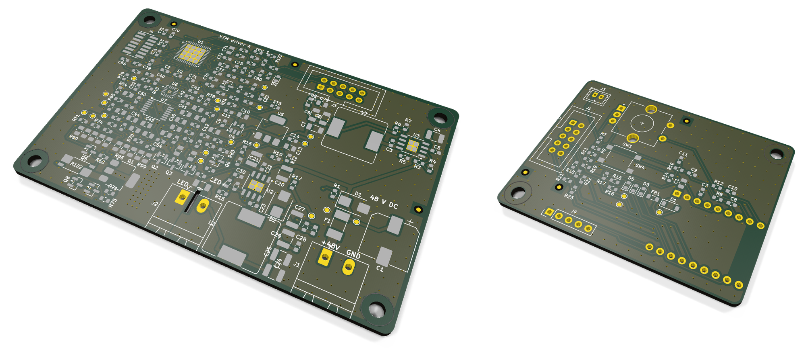
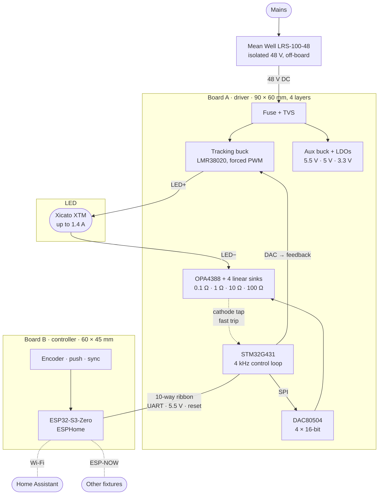
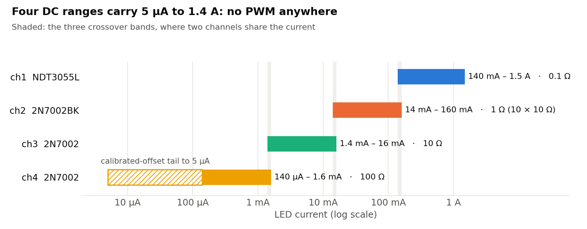
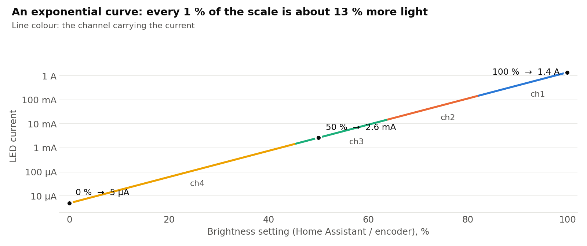
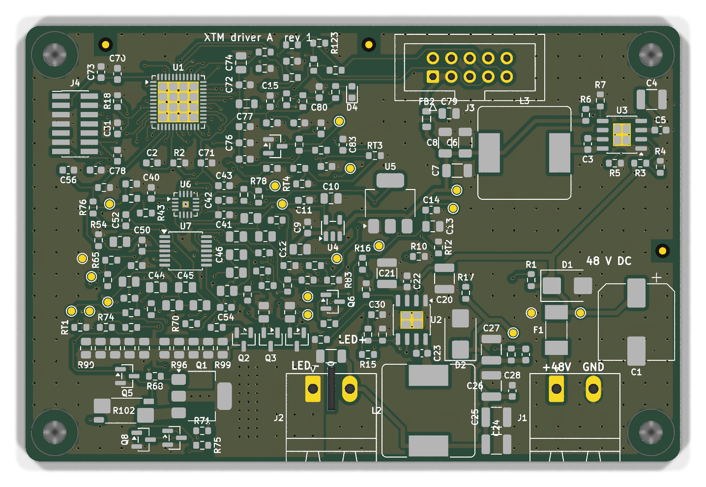
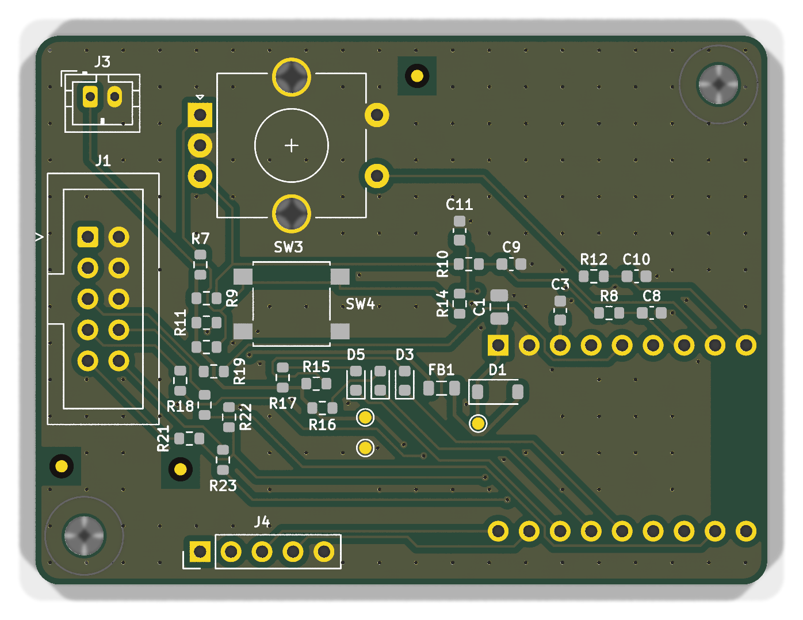
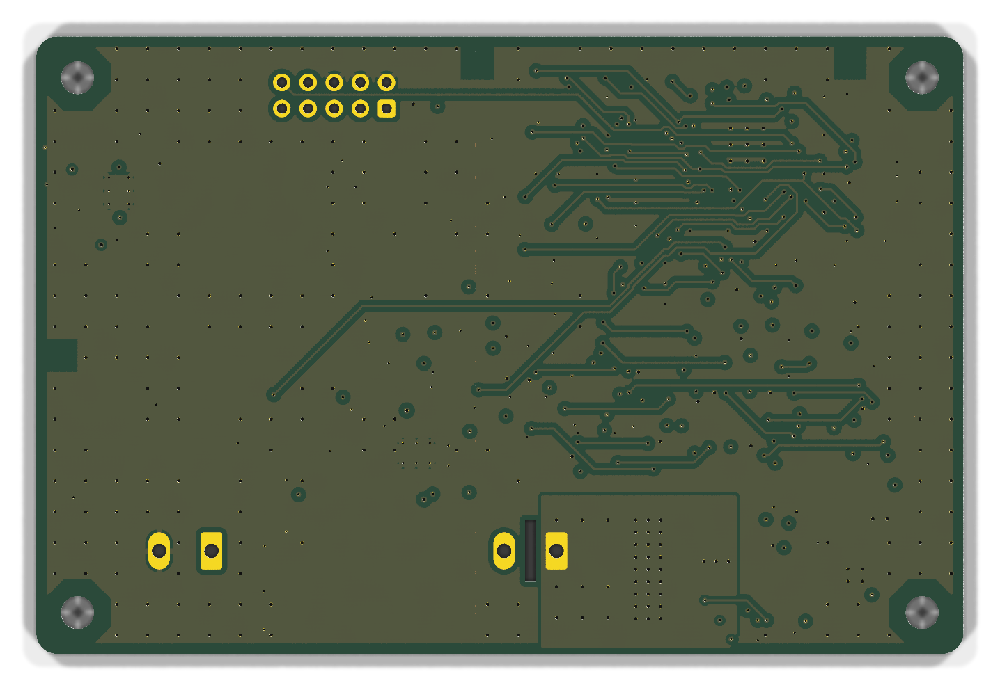
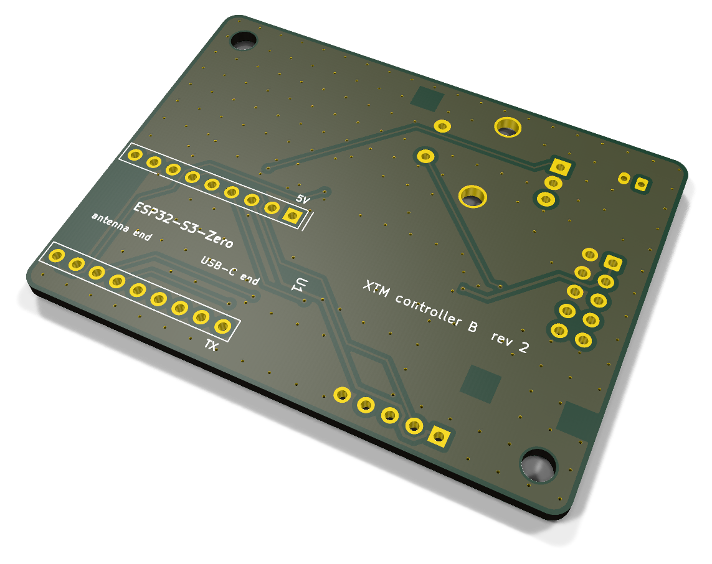

<div align="center">

# XTM LED Driver

**A flicker-free, four-decade DC LED driver for theatrical fixtures.**<br>
1.4 A down to 5 µA as pure DC: no PWM anywhere, nothing for a camera to catch.




[**Build guide**](docs/BUILD_GUIDE.md) ·
[**Design process**](docs/DESIGN_PROCESS.md) ·
[Hardware](docs/HARDWARE.md) ·
[Firmware](docs/FIRMWARE.md) ·
[Design record](docs/design-record/)

</div>

---

I'm building four stage fixtures around the **Xicato XTM19803050CCA** (19 mm LES, 3000 K, about
5000 lm at 1.4 A). Off-the-shelf drivers either dim with PWM, which rolling-shutter cameras turn
into bands, or bottom out around 1%, which makes the end of every fade snap to black. This
project is a two-board driver that does neither: the LED current is DC at every level from full
output down to 5 µA (0.0004%), fades are smooth enough to film in 240 fps slow motion, and each
fixture is a normal dimmable light in Home Assistant with a knob on the back and a sync button
that makes the others follow it.

Everything is here: the schematics (as code), the design calculations and simulations, scripted
KiCad 9 layouts that come out DRC-clean, Gerbers and placement files, BOMs with verified part
numbers, firmware for both boards with its tests, and the procedures to bring it up, calibrate
it and prove it doesn't flicker.

## Highlights

- **Four DC ranges, not PWM.** Four linear current sinks with 0.1 Ω, 1 Ω, 10 Ω and 100 Ω shunts
  sit in parallel under the LED. Each covers a decade at the same 14–140 mV sense voltage, so
  every range is equally precise, and a calibrated tail carries the last decade and a half to 5 µA.
- **Crossovers you can't see.** Where two ranges meet, both channels share the current on a
  log-domain blend, and the incoming channel idles at a small keep-alive current so it's already
  regulating when it's needed. Simulated deviation at a crossover: 0.14% on a 10 s fade.
- **A tracking buck that stays out of the picture.** A forced-PWM buck at 400 kHz holds the LED
  anode about 1 V above what the sinks need, set ahead of every current change by the MCU. Its
  ripple sits far above anything a camera or eye integrates.
- **Precision where it counts.** 16-bit DAC, zero-drift op-amps, Kelvin-sensed shunts (a
  four-terminal 0.1 Ω and 0.1% thin film for the rest), a guarded "precision island" on a 4-layer board. After calibration each range
  holds about ±0.1% of reading.
- **Real-time control on the driver.** An STM32G431 runs fades at 4 kHz, the crossovers, the
  headroom loop and the protection (a shorted LED clamps every sink within 100 µs). Wi-Fi never
  touches the light.
- **A friendly controller.** Board B is a socketed Waveshare ESP32-S3-Zero running ESPHome:
  Home Assistant light, rotary encoder with push, status LED, and fixture-to-fixture sync over
  ESP-NOW with authenticated packets. Every fixture also works completely on its own.
- **Layout by script.** Python scripts place every part, draw the critical copper by hand-coded
  rules, route the rest with Freerouting, pour and stitch ground, run DRC and export JLCPCB files.
  Both boards come out with 0 errors and 0 unconnected items.

## How it works



The **sinks** set the LED current; the **buck** only supplies the voltage they need. Board A's
MCU knows the LED's forward voltage at every current (it learns it as it runs), so on a rising
cue it raises the buck first and then the current, and on a falling cue the reverse. Only a
level, a fade time and status cross the ribbon to Board B.

<picture>
  <source media="(prefers-color-scheme: dark)" srcset="docs/images/ranges-dark.png">
  
</picture>

Brightness is exponential in the setting, so every step looks the same size: 1% of the scale is
about 13% more light, from 5 µA at the bottom to 1.4 A at the top.

<picture>
  <source media="(prefers-color-scheme: dark)" srcset="docs/images/curve-dark.png">
  
</picture>

## The boards

| | Board A: driver | Board B: controller |
| --- | --- | --- |
| **Top** |  |  |
| **Bottom** |  |  |
| Size | 90 × 60 mm, 4 layers, ENIG | 60 × 45 mm, 2 layers, ENIG |
| Parts | 206 on 96 nets | 42 on 32 nets |
| Does | 48 V in, tracking buck, four sinks, protection, fades, calibration | Wi-Fi and Home Assistant, knob, sync, status LED |
| Key parts | STM32G431CBU6, DAC80504, OPA4388, 2 × LMR38020, NDT3055L, WSK2512 | Waveshare ESP32-S3-Zero-M on sockets, Bourns PEC11R encoder |
| Layout result | 0 DRC errors, 0 unconnected | 0 DRC errors, 0 unconnected |

Renders are bare boards from KiCad (no 3D models for the parts). The ESP32-S3-Zero plugs into
two sockets on Board B's back, so it can be pulled out and flashed over its own USB-C.

## Specifications

Design values from the calculations and simulations in [`design/`](design/). None of this has
been measured on hardware yet.

| Parameter | Design value |
| --- | --- |
| Output | 5 µA to 1.4 A DC (1.5 A with tolerance), four ranges plus a calibrated tail |
| Brightness curve | Exponential: 0–100% → 5 µA–1.4 A, about 13% more light per 1% step |
| Flicker target | Under 1% at any frequency from 100 Hz to 20 kHz, at every level and during fades |
| Accuracy after calibration | ±0.09–0.11% RSS in each range; ±0.6% at 14 µA and ±1.6% at 5 µA |
| Crossover smoothness | 0.11–0.14% on a 10 s full-range fade, 0.9–1.5% on a 1 s fade (simulated) |
| Response | Snaps within 5 ms; fades updated at 4 kHz, from instant to 10 minutes |
| Input | 48 V DC (43.2–52.8 V) from a Mean Well LRS-100-48; about 45 W at full output |
| LED voltage | 3.5 V floor to 38 V usable, 40.4 V hard ceiling |
| Protection | Shorted LED (every sink clamped within 50–100 µs), open LED, undervoltage, four temperature sensors with derating, DAC read-back, watchdog, 3 A fuse, TVS on input and output |
| Link loss | Board A blinks twice and settles at 20% if Board B goes quiet; planned restarts hold the level |
| Control | Home Assistant (ESPHome native API), encoder with push, sync button and a header for a panel-mount button |
| Group sync | ESP-NOW broadcast, fixture to fixture, HMAC-SHA256 authenticated; no router or HA in the path |

## Status

| Stage | State |
| --- | --- |
| ✅ Circuit design, calculations, crossover simulation | Done; `design/calc.py` asserts the limits that matter |
| ✅ Schematics (as code) with connectivity check | Done; 0 ERC errors on both boards |
| ✅ Part numbers | Every numbered part checked against a distributor or manufacturer page (29 Sep 2026) |
| ✅ PCB layout | Done by script; both boards 0 DRC errors, 0 unconnected |
| ✅ Board A firmware | Builds (50–58 KB of 126 KB, depending on the toolchain); 97,146 host-test checks pass |
| ✅ Board B firmware | ESPHome config validates; 89 unit checks and a 43-check end-to-end test on ESPHome's Linux build pass |
| ⏳ ESP32-S3 build | Not yet run; the CI workflow in `.github/workflows/` runs it on every push |
| ⏳ Fabrication, assembly, bring-up, flicker measurements | Not started |
| ⚠️ Known firmware issue | Board A detects an open LED only near full output, and learns a bad correction while the LED is disconnected; see [known issues](docs/FIRMWARE.md#known-issues) |

If you build one before I do, I'd love to hear how it went.

## Repository map

```text
xtm-led-driver/
├── design/                 schematics as code, calculations, simulation
│   ├── board_a.py          every Board A part and pin-to-net connection
│   ├── board_b.py          the same for Board B
│   ├── catalog.py          part data: MPNs, LCSC numbers, footprints, verification notes
│   ├── build.py            regenerates hardware/ and runs the connectivity check (ERC)
│   ├── calc.py             every design number; prints calc_output.txt
│   ├── sim/handover.c      time-domain model of a crossover between two sinks
│   ├── compare_netlists.py checks your own KiCad schematic against the generated netlist
│   └── kicad_pos_to_jlc_cpl.py   KiCad position file → JLCPCB CPL, with rotation fixes
├── hardware/               generated from design/: per board, sheet tables, netlist, BOMs
│   ├── board_a/  board_b/
│   ├── board_a.kicad_dru   custom DRC rules (48 V spacing, precision-island clearance)
│   └── LAYOUT.md           the layout rules the scripts follow and you review against
├── layout/                 scripted KiCad 9 layout + Freerouting
│   ├── run_layout.bat      Windows launcher (double-click)
│   ├── make_board.py       stages: place, route, pour, stitch, DRC, export
│   ├── board_a_layout.py   Board A placement, hand-drawn copper, pours, rules
│   ├── board_b_layout.py   Board B the same
│   ├── lib/XTM.pretty/     this project's ESP32-S3-Zero socket footprint
│   └── out/                the finished boards: KiCad projects, Gerbers, CPL, DRC reports
├── firmware/
│   ├── board-a/            STM32G431 firmware in C (CMake), host tests, calibrate.py, flicker.py
│   └── board-b/            ESPHome configs + the xtm_driver external component, tests
└── docs/
    ├── BUILD_GUIDE.md      how to use these files and build the whole thing
    ├── DESIGN_PROCESS.md   how the design got here, and why
    ├── HARDWARE.md         circuit reference
    ├── FIRMWARE.md         firmware reference
    └── design-record/      the Phase 1 review and Phase 2 detailed design, as written
```

## Quick start

**Just want the boards?** The finished layouts are in [`layout/out/`](layout/out/): upload
`board_a-gerbers.zip` and `board_b-gerbers.zip` to JLCPCB with the settings in
[the build guide](docs/BUILD_GUIDE.md#6-order-the-pcbs-and-stencils), and order parts from the
hand-assembly BOMs in [`hardware/`](hardware/). Read [section 5](docs/BUILD_GUIDE.md#5-review-before-ordering)
first.

**Want to check or change the design?**

```sh
python3 design/build.py            # regenerate netlists and BOMs, run the connectivity check
python3 design/calc.py             # every design number (needs numpy, and gcc for the simulation)
make -C firmware/board-a/tests     # Board A host tests
make -C firmware/board-b/tests     # Board B unit tests
layout\run_layout.bat              # both layouts, on Windows with KiCad 9 and Java 21
```

**Building the firmware?**

```sh
cd firmware/board-a
cmake -B build -G Ninja -DCMAKE_TOOLCHAIN_FILE=cmake/arm-none-eabi.cmake && cmake --build build

cd ../board-b
cp secrets.yaml.example secrets.yaml   # fill in Wi-Fi and keys
esphome run xtm-1.yaml
```

The [build guide](docs/BUILD_GUIDE.md) walks through all of it, from installing the tools to a
calibrated, flicker-tested fixture.

## Documentation

| Document | What's in it |
| --- | --- |
| [Build guide](docs/BUILD_GUIDE.md) | Every step to make one yourself: tools, files, ordering, assembly, flashing, bring-up, calibration, flicker testing, use, troubleshooting, pinouts |
| [Design process](docs/DESIGN_PROCESS.md) | From a 0–10 V dimmer idea to this: the requirements, the reviews, the decisions and what changed them |
| [Hardware reference](docs/HARDWARE.md) | Both boards block by block, with values and the reasoning behind them |
| [Firmware reference](docs/FIRMWARE.md) | Board A's control loop, the link protocol, the ESPHome component |
| [Layout scripts](layout/README.md) | Running and changing the automated layout |
| [Layout rules](hardware/LAYOUT.md) | Stackup, floorplan, power and sense routing, clearances |
| [Design record](docs/design-record/) | The Phase 1 review and the Phase 2 detailed design, complete, as written |

## The design in one chart

The first plan used PWM for the bottom decade and handed the current between ranges with a
simple crossfade. Working through the dynamics showed the crossfade would dip the light by up to
17% on a fast fade, because the incoming channel starts from a wound-down integrator. Priming it
with a keep-alive current and blending in the log domain fixed it:

<picture>
  <source media="(prefers-color-scheme: dark)" srcset="docs/images/crossover-dark.png">
  
</picture>

That story, and the others like it, are in [the design process](docs/DESIGN_PROCESS.md).

## Safety

Board A runs from 48 V and can put 38 V on the LED connector. Neither board carries mains: the
48 V comes from a separate, certified, isolated supply (Mean Well LRS-100-48) with its own fused
inlet. Wire and enclose the mains side of that supply properly, or have someone qualified do it.
Never plug or unplug the LED while the output is on.

## Acknowledgements

- [KiCad](https://www.kicad.org), [Freerouting](https://github.com/freerouting/freerouting),
  [ESPHome](https://esphome.io) and [Home Assistant](https://www.home-assistant.io) do the heavy
  lifting.
- `firmware/board-a/third_party/` carries Arm's CMSIS (Apache-2.0) and ST's STM32G4 device files
  (Apache-2.0) and LL drivers (BSD-3-Clause), under their own licences.
- The ESP32-S3-Zero footprint's pin order was cross-checked against
  [jtomka/kicad-esp32-s3-zero](https://github.com/jtomka/kicad-esp32-s3-zero).

## License

Not chosen yet. Until a `LICENSE` file is added, the default applies: all rights reserved,
except the third-party files under their own licences.
