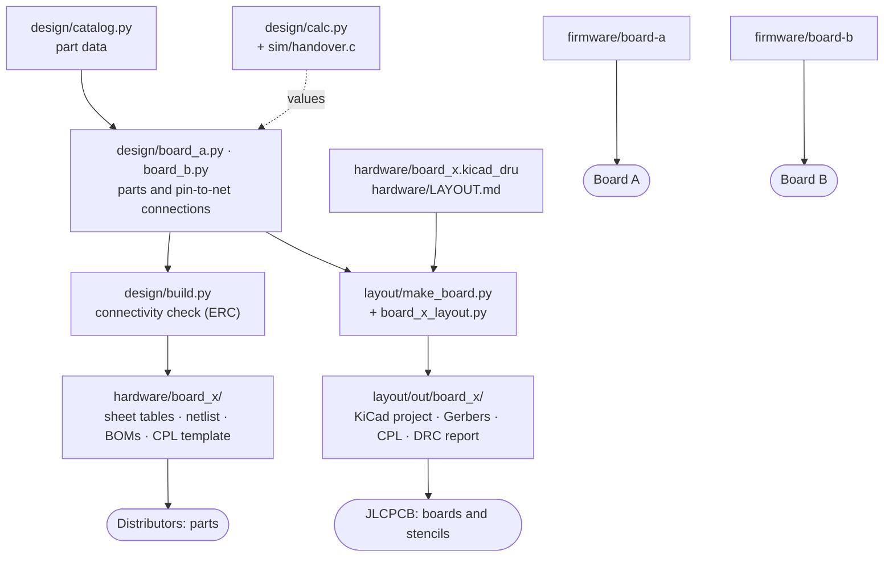
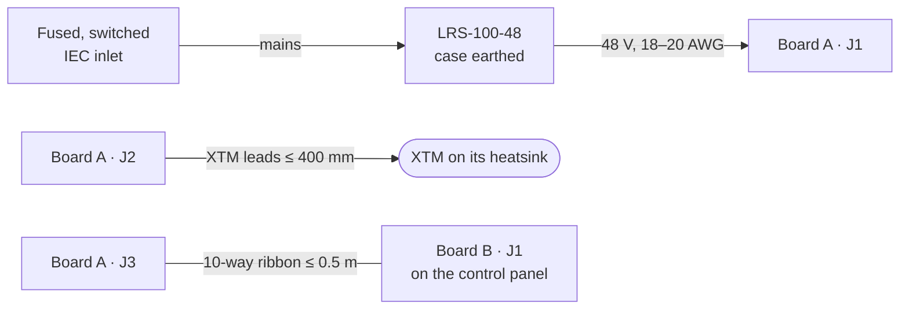

# Build guide

Everything you need to go from this repository to a working, calibrated fixture: what each file
is for, which tools to install, how to regenerate or change the design, how to order boards and
parts, how to assemble, flash, bring up, calibrate and verify it, and how to use it afterwards.

> [!IMPORTANT]
> This design has been fully designed, laid out and simulated, and its firmware tested on a PC,
> but **no board has been built yet**. The first build is also the first test. Go through
> [section 5](#5-review-before-ordering) before you spend money, and treat the bring-up steps as
> real tests: stop at the first one that fails.

## Contents

0. [Before you start](#0-before-you-start)
1. [How the files fit together](#1-how-the-files-fit-together)
2. [Install the tools](#2-install-the-tools)
3. [Check or change the design (optional)](#3-check-or-change-the-design-optional)
4. [Lay out the boards (optional)](#4-lay-out-the-boards-optional)
5. [Review before ordering](#5-review-before-ordering)
6. [Order the PCBs and stencils](#6-order-the-pcbs-and-stencils)
7. [Order the parts](#7-order-the-parts)
8. [Assemble Board A](#8-assemble-board-a)
9. [Assemble Board B and the ribbon](#9-assemble-board-b-and-the-ribbon)
10. [Build the firmware](#10-build-the-firmware)
11. [Bring-up](#11-bring-up)
12. [Calibrate](#12-calibrate)
13. [Verify flicker](#13-verify-flicker)
14. [Install it in the fixture](#14-install-it-in-the-fixture)
15. [Use it](#15-use-it)
16. [Troubleshooting](#16-troubleshooting)

Appendices: [A. Connectors and pinouts](#appendix-a-connectors-and-pinouts) ·
[B. Board A console](#appendix-b-board-a-console) ·
[C. Pre-order checklist](#appendix-c-pre-order-checklist)

---

## 0. Before you start

### What one fixture needs

| Item | Notes |
| --- | --- |
| Board A (driver) | 90 × 60 mm, 4 layers, 206 parts. Takes 48 V, drives the LED |
| Board B (controller) | 60 × 45 mm, 2 layers, 42 parts, one of them a plug-in Waveshare ESP32-S3-Zero-M |
| A 10-way ribbon cable | Up to about 0.5 m (good to 1 m), IDC sockets on both ends |
| Mean Well LRS-100-48 | The isolated 48 V supply, mounted separately with a fused, switched IEC inlet |
| Xicato XTM19803050CCA | On its own heatsink (the design assumes the LED is always adequately cooled) |
| An enclosure | Wood or plastic; PETG or ASA (not PLA) anywhere near Board A or the LED heatsink |

The design is set up for **six sets** (four fixtures and two spares), with parts bought for seven.

### Skills

- **Fine-pitch SMD with a stencil and reflow:** a 0.5 mm-pitch QFN-48, a 3 × 3 mm WQFN-16 with an
  exposed pad, a TSSOP-14, two HSOP-8 with exposed pads, lots of 0603. A hot plate or reflow oven,
  a stencil, and a microscope or loupe for inspection.
- **Through-hole soldering** for the connectors, encoder and sockets.
- **Bench work:** a current-limited supply, a DMM and a scope; the procedures say exactly what
  to measure.
- **Command line:** running Python scripts, CMake and ESPHome.

### Time

| Stage | First fixture | Each after that |
| --- | --- | --- |
| Assembly (both boards) | an evening | a few hours |
| Bring-up | about 2 hours | about 30 minutes |
| Current calibration | about 10 minutes | about 10 minutes |
| Light matching (optional) | about 10 minutes | about 10 minutes |

> [!WARNING]
> **Voltages.** Board A runs from 48 V and can put 38 V on the LED connector. Never plug or unplug
> the LED while the output is on. **Neither board carries mains:** the LRS-100-48 is a certified,
> isolated supply mounted on its own. Its mains side (inlet, fuse, switch, earth) must be wired
> and enclosed properly; if that isn't something you're qualified to do, have someone who is do
> it. The XTM is damaged by reverse polarity: check J2's wiring before first light.

---

## 1. How the files fit together

The design lives in code. Every part and connection is declared once in Python; everything else
is generated from that, checked, and then laid out by scripts.



### Which files do I need?

| If you want to... | Use |
| --- | --- |
| Order the boards as they are | `layout/out/board_a/board_a-gerbers.zip`, `layout/out/board_b/board_b-gerbers.zip` |
| Order the parts | `hardware/board_a/board_a-bom-hand.csv`, `hardware/board_b/board_b-bom-hand.csv` |
| Have JLCPCB assemble instead | `hardware/board_x/board_x-bom-jlc.csv` + `layout/out/board_x/board_x-cpl-jlc.csv` |
| Look at or edit the boards in KiCad | `layout/out/board_x/board_x.kicad_pro` |
| See every part and connection, sheet by sheet | `hardware/board_x/board_x-sheets.md` |
| Draw your own schematic and check it | `hardware/board_x/board_x.net` + `design/compare_netlists.py` |
| Understand a value or re-check a limit | `design/calc.py` (its output: `design/calc_output.txt`) |
| Change a part or a connection | `design/catalog.py`, `design/board_x.py`, then `design/build.py` |
| Move parts or change routing rules | `layout/board_x_layout.py`, then `layout/run_layout.bat` |
| Review a layout against the rules | `hardware/LAYOUT.md` |
| Flash Board A | `firmware/board-a/` |
| Flash Board B | `firmware/board-b/` |
| Calibrate and test for flicker | `firmware/board-a/tools/calibrate.py`, `tools/flicker.py` |

### The generated hardware files

| File (per board, in `hardware/board_x/`) | What it is |
| --- | --- |
| `board_x-sheets.md` | Every part with its value, MPN and footprint, every pin with its datasheet name and net, sheet by sheet; then the full net list. Enough to capture a schematic by hand |
| `board_x.net` | KiCad netlist with footprints and part numbers attached |
| `board_x-bom-hand.csv` | Hand-assembly BOM: one line per part type, quantity per board and for 7 sets plus spares, manufacturer, MPN, Digi-Key/Mouser/LCSC numbers, footprint, placement (stencil, hand, off-board) and verification status |
| `board_x-bom-jlc.csv` | JLCPCB format (Comment, Designator, Footprint, LCSC Part #), with each line's Basic/Extended class |
| `board_x-cpl-template.csv` | The designators JLC's CPL needs; the layout scripts fill in the real one |

In the BOMs, a **Status** of `verified ...` means that part number was checked against a
distributor or manufacturer page; `describe` means any maker's part to the description will do
(passives, headers, tactile switches), so you pick one yourself.

---

## 2. Install the tools

You only need the tools for the steps you're doing.

| Tool | Version | Needed for | Where |
| --- | --- | --- | --- |
| Python | 3.10 or later | Design scripts, calibration tools | python.org, or your OS |
| numpy | any recent | `design/calc.py`, `tools/flicker.py` | `pip install numpy` |
| gcc and make | any recent | The crossover simulation, both host test suites | Linux/macOS native; on Windows, WSL |
| KiCad | 9.0.x | Viewing the boards; the layout scripts | [kicad.org](https://www.kicad.org/download/) |
| Java runtime | 21 or later | Freerouting (layout scripts only) | `winget install EclipseAdoptium.Temurin.21.JRE`, or [adoptium.net](https://adoptium.net) |
| Freerouting | 1.9.0 exactly | Routing | Downloaded automatically on the first layout run |
| arm-none-eabi-gcc | 12 or later | Building Board A's firmware | [Arm GNU Toolchain](https://developer.arm.com/downloads/-/arm-gnu-toolchain-downloads) or xPack; Ubuntu 24.04: `apt install gcc-arm-none-eabi` |
| CMake and Ninja | CMake 3.20+ | Building Board A's firmware | cmake.org, ninja-build.org, or your package manager |
| A flasher | any | Flashing Board A | STM32CubeProgrammer, OpenOCD or pyOCD |
| ESPHome | 2026.9.0 or later (Python 3.12+) | Board B's firmware | `pip install esphome` or `uv tool install esphome` |
| pyserial (+ pyvisa) | any | Calibration over the console (pyvisa to read a SCPI meter) | `pip install pyserial pyvisa` |

On **Ubuntu 24.04** most of it is one line:

```sh
sudo apt install python3-numpy python3-serial gcc make cmake ninja-build \
    gcc-arm-none-eabi libnewlib-arm-none-eabi openocd
pip install esphome        # in a virtual environment with Python 3.12+
```

On **Windows**, install KiCad 9, the Temurin 21 JRE, Python, the Arm GNU Toolchain, CMake and
Ninja, and STM32CubeProgrammer. The layout scripts run natively (`run_layout.bat`); the host tests
and `calc.py`'s simulation want gcc, which is easiest under WSL.

Hardware for flashing: an **STLINK-V3MINIE** (its cable fits Board A's J4 and also carries the
console) and a **USB-C cable** for the ESP32-S3-Zero.

---

## 3. Check or change the design (optional)

Skip this if you're building the boards as they are.

### Regenerate and check

```sh
python3 design/build.py      # rewrites hardware/board_a and hardware/board_b, runs the ERC
python3 design/calc.py       # prints every design number and asserts the limits
```

`build.py` prints each board's part and net count and stops with an error if the connectivity
check fails (a net with only one connection, a declared power net that nothing uses, a pin left
unconnected).
The current design gives:

```text
Board A (driver): 206 parts, 96 nets, 0 ERC errors, 0 warnings
Board B (controller): 42 parts, 32 nets, 0 ERC errors, 0 warnings
```

`calc.py` reproduces `design/calc_output.txt`: the setpoint chain, the buck's feedback network
and timing limits, loop stability for all four sinks, the error budget, thermal estimates, and
(section 5) the crossover simulation, which it compiles from `design/sim/handover.c` with gcc.
It asserts the limits that matter (phase margin, the buck's minimum on- and off-times, the
inductance, the V_out ceiling), so a change that breaks one fails loudly.

### Change a part or a connection

1. **Part data** is in `design/catalog.py`: value, footprint, manufacturer, MPN, LCSC number,
   JLC class, a verification status and, for ICs, the pin names. Change a value there (or add a
   new entry).
2. **Connections** are in `design/board_a.py` and `design/board_b.py`, one `b.add(ref, part,
   {pin: net})` per part, grouped by sheet. Nets are plain names; two pins on the same name are
   connected.
3. Run `python3 design/build.py` and fix anything the ERC reports, then `python3 design/calc.py`
   if you touched anything analog.
4. Re-run the layout ([section 4](#4-lay-out-the-boards-optional)); the netlist the layout uses
   comes straight from these files.

> [!CAUTION]
> Only put a part number in the catalog if you've checked it exists and is stocked. If you're not
> sure, describe the part (value, rating, dielectric, size) and mark it `describe`; a wrong part
> number costs a board revision.

### Capture the schematic in KiCad yourself

The design has no KiCad schematic file: the schematic *is* the code and the sheet tables. If you
want one in KiCad:

- **Straight to layout:** in the PCB editor, File → Import → Netlist, pick
  `hardware/board_x/board_x.net`. Footprints and the ratsnest arrive together (the board then has
  no schematic behind it).
- **Draw it, then prove it:** enter each sheet from `board_x-sheets.md` using the net names as
  labels, export a netlist, and compare:

  ```sh
  python3 design/compare_netlists.py hardware/board_a/board_a.net my_board_a.net
  ```

  It lists every pin whose connections differ, ignoring net names.

---

## 4. Lay out the boards (optional)

The finished, checked layouts are already in `layout/out/`. **Run the scripts only if you
changed the design or the layout rules:** each run starts from the netlist and replaces
`layout/out/board_x/`, and Freerouting's result differs from run to run.

### On Windows

1. Install KiCad 9 (default folder) and a Java 21 runtime ([section 2](#2-install-the-tools)).
2. Double-click `layout\run_layout.bat`, or from a Command Prompt in `layout\`:

   ```bat
   run_layout.bat                          :: both boards, start to finish
   run_layout.bat board_b                  :: one board
   run_layout.bat board_a --stage place    :: placement only, with a preview (a minute)
   run_layout.bat board_a --attempts 10    :: more routing attempts (6 by default)
   ```

The first run downloads Freerouting 1.9.0 into `layout\tools\` (or put
`freerouting-1.9.0.jar` there yourself, or set `FREEROUTING_JAR`). Board B takes a minute or
two, Board A 5 to 30 minutes; Freerouting opens its own window while it works. Leave it alone.

### On Linux or macOS

The scripts need KiCad 9's Python (`import pcbnew` must work) and `kicad-cli` on the PATH. With
KiCad from your distribution's packages, the system Python usually has `pcbnew`:

```sh
cd layout
python3 -c "import pcbnew; print(pcbnew.Version())"   # should print 9.0.x
python3 make_board.py board_b
python3 make_board.py board_a --attempts 10
```

On macOS, run them with the Python inside the KiCad application bundle.

### What a run does and writes

Each board goes through: place every part → draw the critical copper (switch nodes, cathode
copper, shunt bus bars, ground plane, a via beside every ground pad) → route the rest with
Freerouting, clean up and retry → pour and stitch ground → DRC with the custom rules → export.
Outputs in `layout/out/board_x/`:

| File | What it is |
| --- | --- |
| `board_x.kicad_pro`, `.kicad_pcb`, `.kicad_dru` | The KiCad project; open the `.kicad_pro` |
| `board_x-gerbers.zip` | Gerbers and drill files, ready to upload |
| `board_x-cpl-jlc.csv` | Placement file in JLCPCB's format (`board_x-pos.csv` is KiCad's own) |
| `board_x_drc.json` | The final DRC report |
| `board_x-1-FCu_FSilkS.png` etc. | Previews of each copper layer |
| `board_x_run.log` | What happened; the last line says whether it's complete |

The run is complete when the log ends with `done in ... s: 0 DRC errors, 0 unconnected`.

### If connections are left open

1. Run that board again, perhaps with `--attempts 10`; or
2. open the `.kicad_pro` in KiCad, route the few ratsnest lines left (the log lists them), press
   **B** to refill zones, save, close KiCad, and run `run_layout.bat board_a --stage export`. That
   re-stitches the pours, re-runs the DRC and rewrites the Gerbers and CPL without touching what
   you drew.

The export stage is also how to regenerate outputs after any hand edit. Details:
[`layout/README.md`](../layout/README.md).

---

## 5. Review before ordering

A DRC-clean board can still be wrong in ways no rule sees. Do these before ordering, whether you
use the committed layouts or your own. The full list is [Appendix C](#appendix-c-pre-order-checklist).

**Open each board in KiCad 9** (`layout/out/board_x/board_x.kicad_pro`):

- **Inspect → Design Rules Checker**, "Refill all zones" ticked: no errors, nothing unconnected.
  Silkscreen warnings are expected (36 on Board A, 2 on Board B); look at any that sit on a pad.
- **View → 3D Viewer**: every part on the right side; J1, J2 and J3's openings face off the board.
- **Board A power stage:** U2's SW pin, C23 and L2 pad 1 joined by short, wide copper on the top
  layer with no vias (the same for U3, C3 and L3); C22 right at U2's VIN pin with a ground via
  beside it.
- **Board A cathode:** J2 pin 1, C60, R110 and the four drains on the tab copper; the heat
  spreader under it on the bottom layer, joined by 39 vias; R102 at least 2 mm from it; the 1 mm
  slot between J2's pads.
- **Board A sinks:** each SNSHIx/SNSLOx track starts at its shunt's Kelvin pads; the divider
  bottoms (R46, R48, R50, R52) and C44–C47 return to SNSLOx, not to ground.
- **Board B:** U1's two socket rows on the back, pin 1 (square pad, marked **5V**) at the USB-C
  end nearest the middle of the board; no copper under the antenna end at the right-hand edge.
- **Holes:** Board A's four M3 holes and Board B's two are unplated, nothing inside their rings.

**Print both boards 1:1** (File → Plot → PDF, scale 1:1) and lay the parts that can surprise on
their footprints: the SRR1260 inductors, the 10 × 10 mm electrolytic, the Phoenix connectors, the
box headers, the encoder (its lugs go into round 2.6 mm holes), and **the ESP32-S3-Zero on Board
B's back** (plot B.Cu, B.SilkS and Edge.Cuts **mirrored**, then put the module's pins in the pads).
The ESP32-S3-Zero footprint is this project's own (`layout/lib/XTM.pretty`), drawn from
Waveshare's figures.

**Check footprints against datasheets** for the parts that bite: U6 DAC80504 (TI RTE0016D, 0.8 mm
exposed pad, pin 1), U7 OPA4388 (TSSOP-14), U2/U3 LMR38020 (HSOP-8 exposed pad against TI's DDA
land pattern), U1 STM32G431CBU6, R102 WSK2512 (pads 1 and 4 carry current, 2 and 3 sense), Q1
NDT3055L (G-D-S, tab = drain), D3 BAV199, J4 STDC14 against Samtec's FTSH drawing.

**Check the mechanics** against your enclosure: Board A's holes and 10 mm standoffs with air on
both faces and wire access to J1/J2; Board B's encoder shaft length through your panel, **12–14 mm
of room behind Board B** for the module on its sockets, and the antenna end clear of metal.

**Compile Board B's firmware once** (`esphome compile xtm-1.yaml`, [section 10](#10-build-the-firmware)).
It's the one build that hasn't been run yet.

---

## 6. Order the PCBs and stencils

The boards are laid out for [JLCPCB](https://jlcpcb.com)'s standard capabilities. Upload each
`board_x-gerbers.zip` from `layout/out/` and choose:

| Option | Board A | Board B |
| --- | --- | --- |
| Layers | 4 | 2 |
| Dimensions | 90 × 60 mm (auto-detected) | 60 × 45 mm |
| Thickness | 1.6 mm | 1.6 mm |
| Stackup | JLC's standard 4-layer stackup (7628 prepreg); no impedance control needed | — |
| Surface finish | ENIG (flat pads for the stencil and the QFNs) | ENIG |
| Outer copper | 1 oz | 1 oz |
| Inner copper | 0.5 oz | — |
| Via covering | Tented | Tented |
| Smallest via | 0.2 mm hole / 0.5 mm pad (JLC's 4-layer minimum is 0.2 / 0.45 mm, no extra cost) | 0.3 / 0.6 mm |
| Quantity | 10 (JLC's minimum is 5) | 10 |
| Stencil | 0.12 mm, top side only | 0.12 mm, top side only |

- **Order number:** the layouts don't reserve a spot for JLC's order number. Either choose the
  option to remove it, or let JLC place it: it's only silkscreen.
- **Board A's slot:** the 1 mm × 6 mm non-plated slot between J2's pads is in the outline and
  drill files. Check it shows in JLC's Gerber viewer.
- **Exposed pads:** the KiCad footprints already split the paste on U1, U2, U3 and U6's exposed
  pads into windowpanes, so the stencil needs no changes.

### If JLCPCB assembles instead

Hand assembly is the recommendation: the precision parts should come from franchised
distributors anyway, and one stencil pass and one cleaning pass give the cleanest analog region.
If you'd rather pay for placement:

- Upload `hardware/board_x/board_x-bom-jlc.csv` as the BOM and `layout/out/board_x/board_x-cpl-jlc.csv`
  as the placement file. **Check every part's rotation in JLC's preview**, especially polarised
  parts and ICs: their library's zero angle doesn't always match KiCad's.
- Board A has 28 Extended part types (each carries a feeder fee). JLC can't place the DAC, the
  op-amp, the 0.1 Ω shunt, the fuse, the three connectors or the sixteen 0.1% resistors LCSC
  doesn't list (12.0k, 10 Ω, 100 Ω): those get soldered by hand afterwards.
- Board B has 3 Extended types; J1, J3, J4, the encoder and the sockets are hand-soldered, and the
  ESP32-S3-Zero plugs in.
- Descriptive BOM lines need a part picked in JLC's BOM tool, and some stock was short on
  29 Sep 2026 (the TDK 4.7 µF 100 V capacitors, the TPS7A2050, the STM32): pick an in-stock
  equivalent 4.7 µF 100 V 1210, and pre-order or consign the two ICs.

---

## 7. Order the parts

Order from the **hand-assembly BOMs**, `hardware/board_a/board_a-bom-hand.csv` (65 lines) and
`hardware/board_b/board_b-bom-hand.csv` (23 lines). The "Qty for 7 boards (+spares)" column is
already the buy quantity. Check stock on the day.

### The ones that are easy to get wrong

| Part | Get exactly | Not |
| --- | --- | --- |
| U2, U3 buck | **LMR38020FDDAR**, the forced-PWM variant (light-load pulse skipping would put ripple in the audio band) | LMR38020**S**DDAR |
| SW3 encoder | **PEC11R-4220F-S0024** (flatted shaft) from Digi-Key, Mouser or Newark | LCSC's PEC11R-4220K (knurled) |
| J4 debug header | **Samtec FTSH-107-01-L-DV-K** | FTSH-107-01-L-DV-K-A (its alignment pins need holes the footprint doesn't have) |
| J1, J2 on Board A | Phoenix **1757242** headers, plus **1757019** plugs (on the BOM as an off-board line) | — |
| R102 0.1 Ω shunt | Vishay **WSK2512R1000FEA** (four-terminal) | If its lead time is long: **WSL2512R1000FEA** fits the same pads (two-terminal; range 1 widens to ±0.17%) |
| Q2 / Q3, Q4 sink FETs | Nexperia **2N7002BK,215** for Q2; Nexperia **2N7002,215** for Q3, Q4 | Other makers' 2N7002: Nexperia's has the gate-leakage limit the bottom range needs |
| U1 on Board B | Waveshare **ESP32-S3-Zero-M** (headers fitted; 4 MB flash, 2 MB PSRAM) | The version without headers, unless you'll fit 2.54 mm male headers yourself |

Buy the **precision parts from franchised distributors** (TI, Digi-Key, Mouser, Newark, Arrow,
Avnet): DAC80504RTET (or RTER), OPA4388IPWR, the RT0805 0.1% 25 ppm/°C thin-film resistors,
NDT3055L and the Vishay shunt. The 10 ppm/°C RT0805BRB grade in the same values roughly halves
the drift terms in the error budget if you can find it.

**Stock notes from 29 Sep 2026:** the TDK C3225X7S2A475K200AB (4.7 µF 100 V 1210) and the
TPS7A2050PDBVR were out of stock at LCSC (any 4.7 µF ≥100 V X7R/X7S 1210 fits); LCSC had only a
few dozen STM32G431CBU6 (order early). The WSK2512 had no distributor stock.

**Descriptive lines** (18 on Board A, 6 on Board B) are passives, headers and switches where any
maker will do. For each, check value, voltage rating, dielectric (C0G where it says C0G, 100 V
where it says 100 V) and size.

**Keep the 0.1% resistors identified.** They look exactly like the 1% ones; keep them on their
tapes or in labelled bags until they're on the board.

### Not on either BOM

| Item | Per fixture | Notes |
| --- | --- | --- |
| Xicato XTM19803050CCA + heatsink | 1 | Leads are fixed, 20 AWG, 400 mm |
| Mean Well LRS-100-48 | 1 | From an authorised Mean Well distributor (marketplace units are often counterfeit) |
| Fused, switched IEC inlet + mains cord | 1 | For the supply |
| 10-way ribbon, 28 AWG, 1.27 mm pitch, with two 2 × 5 IDC sockets | 1 | Up to about 0.5 m |
| M3 standoffs (10 mm) and screws | 4 for Board A, 2 for Board B | Board B's third fixing is the encoder's panel nut |
| Encoder knob | 1 | For a 6 mm flatted (D) shaft |
| Hook-up wire for 48 V | — | 18 or 20 AWG to J1 |
| Panel-mount sync button (optional) | 1 | Normally open, to Board B's J3 with a JST PH 2-pin plug |

Once for the whole build: an **STLINK-V3MINIE** and a **USB-C cable**.

### Bench equipment

| For | You need |
| --- | --- |
| Bring-up | A bench supply to 60 V with a current limit; a DMM; an oscilloscope; a dummy load of ten 1 W white LEDs in series on a heatsink (about 30 V, good for 350 mA) |
| Calibration | A 6½-digit DMM with a 100 µA range (and 3 A); a lux meter if you'll light-match fixtures |
| Flicker check | A BPW34 (or similar PIN) photodiode, a FET-input op-amp (e.g. OPA140), 10 kΩ, 1 MΩ, 100 pF and 2.2 pF parts, two 9 V batteries; a scope with CSV export; a phone with 240 fps slow motion |

---

## 8. Assemble Board A

All SMD parts are on the top side. C29 (22 pF) is **not fitted**: its footprint is a spare.

1. **Inspect the bare board:** the J2 slot is cut, the four M3 holes are unplated.
2. **Paste** through the 0.12 mm stencil.
3. **Place** every SMD part, including J4 (the 1.27 mm debug header). Mind these:
   - **U1** STM32G431 (QFN-48), **U6** DAC80504 (3 × 3 mm WQFN-16) and **U7** OPA4388 (TSSOP-14):
     pin 1 to the silkscreen dot.
   - **U2, U3** LMR38020 (HSOP-8): exposed pad down, pin 1 to the mark.
   - **Q1** NDT3055L (SOT-223): the tab is the drain, on the big copper area.
   - **R102** WSK2512: four terminals, pads 1 and 4 carry current, 2 and 3 sense. It only fits one
     way round electrically, so check it against the footprint.
   - **D1** SMBJ58A and **D2** SMBJ43A: cathode band to the marked end. **D3** BAV199 (SOT-23).
   - **C1** electrolytic: polarity to the silkscreen.
   - **R90–R99:** the ten 10 Ω 0.1% resistors of the channel-2 ladder.
   - **0.1% resistors** in their right places: 12.0k (R45, R47, R49, R51), 1.00k (R46, R48, R50,
     R52), 10 Ω (R90–R100) and 100 Ω (R101). Check against `board_a-sheets.md` as you go.
4. **Reflow.**
5. **Inspect** under magnification: bridges on U1, U6 and U7, the exposed pads (a little solder
   visible at the edges), tombstoned 0603 parts.
6. **Hand-solder** J1 and J2 (Phoenix headers, wire openings off the board) and J3 (the 2 × 5 box
   header, key slot to the silkscreen outline).
7. **Clean. This is not optional.** Scrub the whole board with isopropyl alcohol and a soft
   brush, especially around J2, the CATHODE copper, the sinks and the precision island; rinse
   with fresh IPA; dry it warm (50 °C for 30 minutes). At 5 µA, 50 nA of leakage through flux
   residue is a 1% error: flux between a 40 V node and the cathode is the one thing that can
   visibly shift the bottom of the range.
8. **No conformal coating** (no haze or fog in this venue); keep the board clean instead.

Don't power it yet: [bring-up](#11-bring-up) starts with resistance checks.

---

## 9. Assemble Board B and the ribbon

### Board B

1. **Paste and place** the SMD parts on top: C1, C3, C8–C11, D1 (B5819W, cathode band to the
   mark), D3–D5 (red, green, blue LEDs: check polarity), FB1, R7–R23, SW4 (the tactile switch;
   pick a height that reaches your panel). **Reflow** and inspect.
2. **Hand-solder on top:** J1 (2 × 5 box header, key slot to the silkscreen), SW3 (the encoder,
   including its two mounting lugs), J3 (JST PH, for an external sync button) and J4 (the 1 × 5
   spare header, optional).
3. **Fit the ESP32-S3-Zero's sockets on the back.** Plug the module's pins into the two 1 × 9
   sockets first. Then put the sockets into U1's footprint **from the back of the board**, module
   hanging below it, with the module's **USB-C end toward the middle of the board** and its
   **antenna end at the board's right-hand edge** (the back silkscreen says "USB-C end" and
   "antenna end", and marks pin 1 **5V** and pin 18 **TX**). Tack one pin of each socket from the
   top side, check everything sits square, then solder all 18 pins and pull the module out.
   Soldering with the module in keeps the two sockets exactly parallel.
4. **Clean** with IPA.

> [!CAUTION]
> The module also fits rotated 180°, which puts 5 V on a GPIO. Always check the USB-C end points
> into the board and the antenna end sits at the edge.

The module is flashed **out of its sockets** ([section 11, step 7](#11-bring-up)).

### The ribbon

A straight-through 10-way ribbon, pin 1 to pin 1 (Board A's J3 and Board B's J1 have the same
pinout, [Appendix A](#appendix-a-connectors-and-pinouts)). Crimp both IDC sockets with the red
stripe on pin 1, keys on the same side, so the cable isn't twisted. The box headers' keys then
stop it going in the wrong way.

---

## 10. Build the firmware

### Board A (STM32G431)

```sh
cd firmware/board-a
cmake -B build -G Ninja -DCMAKE_TOOLCHAIN_FILE=cmake/arm-none-eabi.cmake
cmake --build build
make -C tests                 # host tests for src/core (97,146 checks, ASan/UBSan)
```

That gives `build/board_a.elf`, `.bin` and `.hex`: 50–58 KB of the 126 KB available, depending on
the toolchain (the last 2 KB page holds calibration and settings). If the toolchain isn't on your PATH, add
`-DARM_TOOLCHAIN_DIR=/path/to/toolchain/bin` to the first `cmake` line.

### Board B (ESPHome on the ESP32-S3-Zero)

1. Create your secrets file:

   ```sh
   cd firmware/board-b
   cp secrets.yaml.example secrets.yaml
   ```

2. Fill it in: your Wi-Fi SSID and password; a fallback hotspot password (8+ characters); one
   **sync key** shared by every fixture (12–64 characters); and one **API key per fixture**,
   32 random bytes in base64, each made with:

   ```sh
   python3 -c "import os,base64;print(base64.b64encode(os.urandom(32)).decode())"
   ```

   Keep `secrets.yaml` out of version control (the `.gitignore` already does).

3. Compile each fixture's configuration once, to check it:

   ```sh
   esphome compile xtm-1.yaml       # the first run downloads the ESP32 toolchain
   ```

   `xtm-1.yaml` to `xtm-4.yaml` differ only in name and API key; they all include
   `xtm-common.yaml`, which is the device.

4. Optional tests (Linux or WSL):

   ```sh
   make -C tests                          # link client and sync logic, 89 checks
   cd tests/host
   esphome compile --only-generate xtm-host.yaml
   python3 build_host.py                  # ESPHome's Linux build with the system g++
   python3 run_host_test.py               # 43 end-to-end checks against a simulated Board A
   python3 check_sync_glue.py             # the ESP-NOW code against ESPHome's headers
   ```

Flashing happens during bring-up, below.

---

## 11. Bring-up

Seven steps from a bare, assembled Board A to a working light. Each step has a **pass** line;
stop at the first miss and see [troubleshooting](#16-troubleshooting). The tests are deliberately
the minimum that proves the board is safe and the loops behave; calibration and the flicker check
catch the rest.

Test points on Board A: **TP1** +48V, **TP2** +5V5, **TP3** +5VA, **TP4** +3V3, **TP5** VOUT,
**TP6** cathode tap, **TP7** BIAS, **TP8/TP9** GND, **TP10** buck DAC, **TP12/14/16/18** the four
setpoints, **TP13/15/17/19** the four sense points.

### Step 1: Before power

Inspect U1, U2, U3, U6 and U7 under magnification, and the polarity of D1–D3 and C1. Measure to
GND: TP1 (+48V) about 78 kΩ; TP5 (VOUT) about 170 kΩ; TP2, TP3 and TP4 above 1 kΩ once the meter
has charged the capacitors.

**Pass:** no reading under 10 Ω.

### Step 2: First power

No LED, no Board B. Bench supply to J1 (pin 1 +48V, pin 2 GND), set to 48 V with a **100 mA
limit**, and raise it slowly from 0 V: the aux rails start between 32 and 41 V.

**Pass:** input current under 30 mA; TP2 5.53 V ±3%, TP3 5.00 V ±1.5%, TP4 3.30 V ±2%, TP7 0.455 V
±2%; TP5 near 0 V (the main buck stays off until the firmware runs).

### Step 3: Flash Board A and boot

Plug the STLINK-V3MINIE into J4 (its cable is keyed); Board A stays powered from the bench supply
(the STLINK senses the target voltage but doesn't power it). Flash with any of:

```sh
STM32_Programmer_CLI -c port=SWD mode=UR -w build/board_a.elf -v -rst
openocd -f interface/stlink.cfg -f target/stm32g4x.cfg -c "program build/board_a.elf verify reset exit"
pyocd flash -t stm32g431cbux build/board_a.elf
```

Leave the option bytes at their factory values (nSWBOOT0 = 1, so the BOOT0 pin decides the boot
mode); check with `STM32_Programmer_CLI -c port=SWD -ob displ`. Open the STLINK's virtual COM
port at **115200 8N1** (any serial terminal). The status LED D4 blips every 2 s when idle.

**Pass:** the banner reads `dac80504=ok`; `st` shows `state=off`, `v48` within 1% of the supply,
`vout` 3.5 V (check at TP5), and all four temperatures (`t=`) within 3 °C of the room.

`st` prints one line of `key=value` fields. `fault=` is a number: 0 none, 1 short, 2 open LED,
3 over-temperature, 4 undervoltage, 5 DAC, 6 buck. The LED voltage is `vout` minus `vcath`.

### Step 4: No-load protection

Type `b 1`: full output with nothing connected, so no current can flow. Board A keeps raising
V_out looking for headroom, reaches its 38 V ceiling, reports an open LED and drops back to its
floor. It retries three times, 5 s apart, then latches.

**Pass:** within about 3 s, `st` shows `state=fault fault=2` and `vout` back at about 3.5 V.

Then type **`reboot`**. It clears the fault, and it also throws away the forward-voltage
corrections Board A learned while nothing was connected. They only live in RAM until something is
saved, but left in place they'd make the next start at that current look like a short.

> [!NOTE]
> Board A recognises an open LED only once V_out reaches its ceiling, which with the default LED
> model happens near full output (above roughly 0.9 A). At lower levels an open output just sits
> at a raised V_out with no fault. Whenever the LED has been disconnected with the light on,
> `reboot` before connecting it again. See the known issues in [the firmware reference](FIRMWARE.md#known-issues).

### Step 5: Dummy load, every channel

`set 9 0.3` (full scale 0.3 A for this step; not saved). Connect the dummy load (ten white LEDs)
to J2 (**pin 2 LED+, pin 1 LED−**) with the DMM in series, then step through `b 0.2`, `b 0.4`,
`b 0.6`, `b 0.8` and `b 1.0`: about 45 µA, 0.4 mA, 3.7 mA, 33 mA and 300 mA, which exercises all
four channels.

- **Pass, per point:** the DMM within 3% of `st` (5% at 45 µA; calibration fixes the rest), and
  the cathode between 0.5 and 1.2 V.
- **Loops:** on the scope, TP5 shows only the 400 kHz ripple (about 27 mV p-p) and the active
  channel's sense point (TP13, 15, 17 or 19) is flat DC, with no oscillation at any level. A snap
  from `b 0.3` to `b 0.9` moves V_out smoothly within about 2 ms.
- **Fades:** `b 1 10000`, then `lvl 0 10000`. No fault; smooth both ways, ending dark. (`b 0` is
  the bottom of the curve, 5 µA, not off; `lvl 0` and `off` are off.)
- **Short:** at `b 0.4`, short J2's pins with a wire. **Pass:** `state=fault fault=1` at once and
  the light off. Remove the wire, `clear`.

### Step 6: The XTM

`set 9 1.4`. With the light off, connect the XTM to J2: **red lead (LED+) to pin 2, black lead
(LED−) to pin 1** (the silkscreen says LED+ and LED−). Raise the supply's current limit to 2 A.
`b 1`.

**Pass:** `st` shows `i=` about 1.40, an LED voltage (`vout` − `vcath`) of 28.6–36 V and `vcath`
about 1.0 V. After
10 minutes at full, the FET sensor stays under 90 °C with no derating flag, and the supply draws
about 1 A.

### Step 7: Board B

1. With the ESP32-S3-Zero **out of Board B**, plug it into your computer with a USB-C cable and
   run `esphome run xtm-1.yaml` in `firmware/board-b`. If the port doesn't appear, unplug it, hold
   its **BOOT** button while plugging it back in, and run the command again.
2. Plug the module into Board B's sockets (USB-C end toward the middle of the board), connect the
   ribbon, and power Board A. The status LED is green for 2 s, then goes dark.

> [!WARNING]
> Never plug USB into the module while it's in Board B with the ribbon connected. Its 5V pin is
> its USB supply, so Board A's 5.5 V would push back into your computer. For USB logs in place,
> unplug the ribbon first. After the first flash, updates go over Wi-Fi.

**Pass:** Home Assistant shows the fixture with Driver link on; a 50% turn-on with a 2 s
transition fades in; the knob steps and the push toggles.

**Link loss:** unplug the ribbon with the light on. **Pass:** after 1.5 s the light blinks twice
and settles at 20%; plugged back in, it returns to its level within about a second.

Then calibrate, then check for flicker.

---

## 12. Calibrate

Each fixture needs one **current calibration** (about 10 minutes, scripted). **Light matching**
across fixtures is optional and takes another 10 minutes each. Both run over Board A's console
from `firmware/board-a/tools/calibrate.py` (`pip install pyserial`, plus `pyvisa` to read a SCPI
meter directly). On Windows the port is `COMx`; on Linux usually `/dev/ttyACM0`.

### Current, per fixture

**Setup:** a 6½-digit DMM (100 µA range for the bottom points, 3 A for the top) in series with
the XTM's red lead: J2 pin 2 → DMM → LED+. The XTM on its heatsink, the room near 25 °C, and
Board A warmed for 10 minutes at a middle level (the error budget assumes the board stays within
±20 °C of its calibration temperature).

```sh
cd firmware/board-a
python3 tools/calibrate.py current --port /dev/ttyACM0                   # type each DMM reading
python3 tools/calibrate.py current --port /dev/ttyACM0 --dmm "USB0::..."  # or let it read a SCPI meter
```

The script clears the old calibration, then:

1. reads the dark current with every sink off (tens of nA of board and FET leakage);
2. drives each channel alone in raw mode at eight points, two per band, each band on **both**
   channels that share it so they agree at every crossover: ch4 at 140 µA and 1.5 mA, ch3 at 1.5
   and 15 mA, ch2 at 15 and 150 mA, ch1 at 150 mA and 1.4 A (the 1.4 A point settles for 30 s);
3. measures the keep-alive current of channels 3, 2 and 1 as each channel's low point;
4. prints the result (`calshow`) and saves it to flash.

If `st` shows the cathode under 0.4 V at the 1.4 A point (a high-V_f module with a high-burden
meter), measure that point across a 0.1 Ω four-terminal reference resistor with the DMM on volts.

**Result:** ±0.09–0.11% RSS in each range (±0.17–0.32% worst case); in the tail ±0.6% at 14 µA
and ±1.6% at 5 µA. Spot-check by putting the meter back and comparing `st` at a few `b`
positions per range.

### Light matching across fixtures (optional)

The XTM's flux tolerance is ±10%, so four fixtures at the same current can differ by up to 20%
in light. Matching makes them agree at every level (the brightest fixtures then run a little
under 1.4 A at 100%).

1. On each fixture, after its current calibration: a lux meter on the beam axis at a fixed
   distance in a dark room, the fixture warmed 5 minutes at full, then
   `python3 tools/calibrate.py lux --port ...`. It drives 0.14 A and 1.4 A, asks for the two lux
   readings and stores them. Home Assistant then shows the fixture's **Full scale light**.
2. Take the **lowest** full-scale reading of the four as the fleet reference and set it on every
   fixture: `python3 tools/calibrate.py fleet --port ... --ref <lux>`, or the **Fleet reference
   light** number in Home Assistant. 0 turns matching off.

### Where it's stored, and backing it up

Everything lives in the last 2 KB flash page of Board A (magic `XTM1`, CRC-32), which firmware
updates leave alone unless you mass-erase the chip. Writes wait until the light is off or under
10 mA and not fading. **Save each board's `calshow` and `params` output to a text file:** if its
flash is ever erased, `raw ch code` then `cal ch amps` for each listed point, and `set` for each
parameter, then `save`, restores it without the meter (add `dark_a` with the dark current `calshow`
listed). A replacement Board A needs its own calibration.

---

## 13. Verify flicker

**Pass** means nothing over 1% between 100 Hz and 20 kHz at any level, no step or reversal
during a fade, and a smooth fade to black. By design the only periodic content is the buck's
400 kHz ripple (about 0.1% at the bottom of the range) and the 4 kHz fade updates.

### The photodiode rig

- **Sensor:** a BPW34 PIN photodiode at zero bias into a transimpedance amplifier: cathode to the
  op-amp's −IN, anode to ground. A FET-input op-amp (OPA140, for example) on two 9 V batteries,
  so no bench-supply ripple gets in.
- **Gain:** 10 kΩ ∥ 100 pF for the top of the range (160 kHz bandwidth); 1 MΩ ∥ 2.2 pF for the
  bottom (72 kHz).
- **Placement:** down to about 1 mA, 0.5–1 m from the fixture on its axis at 10 kΩ; below that,
  against the fixture's front at 1 MΩ, under a black cloth. Aim for 0.3–3 V out.
- **Capture:** read the DC level DC-coupled, then capture the ripple AC-coupled: 200 ms at
  1 MS/s or faster, exported as CSV. Then:

  ```sh
  python3 tools/flicker.py ripple.csv --mean <DC volts>     # add --dark <volts>: the output with the light off
  ```

  It reports percent flicker below 20 kHz, the largest line from 100 Hz to 20 kHz and the largest
  at 25 kHz and above, then PASS or FAIL.

### What to capture

Light matching off (fleet reference 0), so each `b` below is the current shown.

| Capture | Console | Pass |
| --- | --- | --- |
| Steady levels | `b 1` (1.4 A), `b 0.822` (150 mA), `b 0.638` (15 mA), `b 0.455` (1.5 mA), `b 0.266` (140 µA), `b 0.082` (14 µA), `b 0` (5 µA) | Percent flicker and every line from 100 Hz to 20 kHz ≤ 1% |
| Crossings at the 10 s full-range rate | `b 0.78`, then `b 0.86 800` and back with `b 0.78 800`; the same between 0.60 and 0.68, and 0.41 and 0.49 | Largest departure ≤ 0.3%, no reversal |
| Crossings at the 1 s rate | The same with 80 instead of 800 | ≤ 2%, no reversal |
| Fade to black | From `b 0.3`, `lvl 0 3000` | Smooth to dark, no step at the end |
| Snaps | From off, `b 0.5`; then `b 1` | One rise within 5 ms, no overshoot |

For fades, capture DC-coupled in the scope's high-resolution mode (100 kS/s is plenty) and run
`python3 tools/flicker.py fade.csv --fade`: it compares a 1 ms average with the fade's own trend
and counts any moment the light moves against the fade.

### The phone check

Film a white wall lit by the fixture in **240 fps slow motion**, waving a pencil quickly in front
of it, at the steady levels above and during a 10 s fade. Then, in the camera's manual mode at
1/4000 s or faster, watch the wall in the live view. **Pass:** no rolling bands, no pulsing, a
smooth fade. A PWM-dimmed light shows bands in the same test, which makes a useful comparison.

---

## 14. Install it in the fixture



**The supply.** Mount the LRS-100-48 on its own, with a fused, switched IEC inlet; earth its FG
terminal (it's a Class I supply) and cover its terminals. Leave its output at 48 V: the buck's
timing margins assume at least 48 V in. Wire its +V and −V to Board A's J1 (pin 1 **+48V**, pin 2
**GND**) with 18 or 20 AWG. Only the supply's case is earthed: Board A's holes are unplated and
the 48 V side, the LED and its heatsink all stay floating, which keeps the heatsink's capacitance
out of the LED's ripple path.

**Board A.** On 10 mm M3 standoffs with free air on both faces, near a vent, within about 300 mm
of the XTM (its leads are 400 mm and aren't extended). If it stands vertically, put the J1/J2 edge
at the top so the power section's warm air doesn't rise across the precision island. It
dissipates about 2.8 W at full output: roughly 22 °C above the enclosure air on average.

**The LED.** Red lead to J2 pin 2 (LED+), black to pin 1 (LED−). Twisting the two leads together
keeps them from radiating.

**Board B.** On the control panel: the encoder's shaft through the panel with its nut as the
third fixing, plus the two M3 holes. Leave **12–14 mm behind the board** (plus a millimetre or
two) for the module on its sockets. Keep the antenna end (the board's right-hand edge, seen from
the front) clear of metal by 15 mm, or give it a plastic window, and keep Board B at least
100 mm from Board A and the LED leads.

**Enclosure materials.** PETG or ASA for anything touching Board A or the LED heatsink; PLA
softens too easily.

**Optional panel sync button:** a normally-open push button on a JST PH 2-pin lead into Board B's
J3, in parallel with the on-board sync button.

---

## 15. Use it

### Home Assistant

Each fixture appears as an ESPHome device (Settings → Devices & services, discovered
automatically on the same network). When you add it, Home Assistant asks for the **encryption
key**: that fixture's `xtmN_api_key` from `secrets.yaml`.

It shows up as one **dimmable light**, plus:

| Kind | Entities |
| --- | --- |
| Sensors | LED current and voltage, driver output and 48 V input voltages, four temperatures |
| Status | Driver state, fault, sync role, firmware; link, derating, calibrated and light-matched flags |
| Buttons | Clear fault, identify (blinks the light), restart driver |
| Settings | Link-loss level, bottom current, full-scale current, fleet reference light, link timeout |
| Switch | Sync lead |

Brightness goes to Board A as a level on its own exponential curve, and a transition goes as one
fade command that Board A runs, so fades are as smooth from Home Assistant as from the knob.

### On the fixture

- **Knob:** one detent is 1% of the brightness scale (about 13% more or less light) as an 80 ms
  fade; spinning fast takes 2× or 4× steps. Turning up from off starts at the bottom; turning
  down stops at the bottom.
- **Push:** toggles on and off with a 400 ms fade.
- **Sync button:** makes this fixture the **lead**: every other fixture follows its level. Press
  it on another fixture and the lead moves there; press it on the lead to end the group (every
  fixture keeps its level). Adjusting a follower by hand takes it out of the group.

Sync runs fixture to fixture over ESP-NOW, with no router or Home Assistant in the path. Every
fixture in a group must be on the **same Wi-Fi access point** (ESP-NOW shares the radio's
channel) and have the same `sync_key`.

### The status LED (on Board B)

| Pattern | Meaning |
| --- | --- |
| Green for 2 s | Starting |
| Red, slow blink | No link to Board A |
| Red, fast blink | Board A reports a fault (see the Fault sensor) |
| Blue, steady | This fixture leads the sync group |
| Blue, short blip each second | This fixture follows the group |
| Amber blip every 3 s | Not connected to Wi-Fi (the fixture still works) |
| Off | Normal |

### What happens when something restarts

| What restarts | What happens |
| --- | --- |
| Both boards (power-up) | The light's saved state fades in over 1 s |
| Board B, planned (OTA, restart button) | Board A holds the level; nothing visible |
| Board B, crash or ribbon unplugged | After 1.5 s Board A blinks twice and settles at 20% (the link-loss level); Board B restores the previous level when it's back |
| Board A | Board B sends its level again over 1 s |

### Updating firmware later

Board B: `esphome run xtm-N.yaml` over Wi-Fi (the light holds its level during the update).
Board A: flash with the STLINK as in step 3; its calibration page is kept.

### A venue without Wi-Fi

Every fixture works on its own without Wi-Fi (amber blip). For reliable sync with no access
point at all, make a variant of `xtm-common.yaml` with `wifi:`, `api:`, `ota:` and
`captive_portal:` removed and `espnow: channel: 1` added; you lose Home Assistant and
over-the-air updates (reflash over USB-C with the module out).

---

## 16. Troubleshooting

| Symptom | Likely cause | What to do |
| --- | --- | --- |
| Step 2: aux rails don't start by 41 V | F1 open, D1 reversed, U3 or its EN divider | Check TP1 reaches 48 V; check D1's band; reflow U3 |
| Step 2: input current well over 30 mA | A short on a rail, or a reversed part | Find the hot part (a finger or thermal camera), check D1–D3 and C1 |
| Step 3: SWD won't connect | J4 cable orientation, U1 soldering, NRST held low | Check +3V3 at TP4, reflow U1, check C78 |
| Step 3: banner lacks `dac80504=ok` | U6 soldering or orientation, SPI | Reflow U6 (pin 1!), check R40–R43 |
| Step 3: V_out not 3.5 V when idle | Buck feedback network, BUCK_DAC | Check R12–R15 values, TP10 |
| Step 4: no `fault=2` at `b 1` | Cathode tap reading high, or V_out not reaching its ceiling | Check R110, C61, D3; check TP5 climbs toward 38 V |
| `fault=2` (open) with the LED connected | LED not connected, or wired backwards | Check J2 wiring: red to pin 2. The XTM is damaged by reverse polarity |
| `fault=1` (short) straight away | A real short; the cathode tap reading high; or forward-voltage corrections learned while the LED was disconnected | Check J2 and the LED leads, D3 and C61; `reboot` and try again |
| Oscillation at a sense point | Wrong compensation or gate resistor | Check C52–C55 (2.2 nF C0G), R60–R63 (1 kΩ), R68–R71 (220 Ω) |
| Current off by more than a few % before calibration | 0.1% resistors swapped with 1% ones | Compare against `board_a-sheets.md`; calibrate |
| Bottom of the range drifts or reads high | Flux residue (leakage) | Clean the board again ([section 8](#8-assemble-board-a)) |
| Bottom of a fade jumps or drops out | The LED's own low-current behaviour | Raise the **Bottom current** setting |
| Derating flag at full output | Not enough airflow around Board A | Standoffs, free air, vents; lower headroom if needed |
| Red slow blink on Board B | No link | Ribbon orientation (pin 1 to pin 1); Board A powered and flashed; module the right way round |
| ESP32-S3-Zero not seen over USB | Not in download mode | Hold BOOT while plugging in the cable |
| Board B doesn't start at all | Module rotated 180° in its sockets | Power off, turn it round; the module may be damaged |
| Amber blip | No Wi-Fi | Check `wifi_ssid`/`wifi_password`; the fixture's own hotspot appears as its name |
| Sync doesn't reach another fixture | Different access point or sync key | Same AP and the same `sync_key` on every fixture |

---

## Appendix A: Connectors and pinouts

### Board A

**J1, 48 V in** (Phoenix MSTBA 2,5/2-G-5,08; plug MSTB 2,5/2-ST-5,08): pin 1 **+48V**, pin 2 **GND**.

**J2, LED out** (the same connector): pin 1 **LED− (CATHODE)**, pin 2 **LED+ (VOUT)**.

**J3, ribbon to Board B** (2 × 5 box header, 2.54 mm):

| Pin | Signal | Direction | Pin | Signal | Direction |
| --- | --- | --- | --- | --- | --- |
| 1 | +5V5 | A → B | 2 | GND | |
| 3 | +5V5 | A → B | 4 | GND | |
| 5 | UART TX (Board A) | A → B | 6 | GND | |
| 7 | UART RX (Board A) | B → A | 8 | BOOT0 | B → A |
| 9 | A_OK | A → B | 10 | NRST | B → A (open-drain) |

Board B's J1 has the same pinout; the ribbon is straight-through. UART at 115200 8N1 with 100 Ω
series resistors at each end.

**J4, debug** (STDC14, Samtec FTSH-107, for the STLINK-V3MINIE): 3 +3V3 (sense), 4 SWDIO,
5/7/11 GND, 6 SWCLK, 12 NRST, 13 VCP_RX, 14 VCP_TX; 1, 2, 8–10 not connected.

**Board A MCU (STM32G431CBU6)**

| Pin | Use |
| --- | --- |
| PA0 | V_out sense |
| PA1 | Cathode tap (ADC and COMP1, the short trip) |
| PA2 / PA3 | USART2 console, through the STLINK's virtual COM port |
| PA4 | DAC1 → buck feedback injection |
| PA6, PA7, PB2, PB15 | Gate monitors, channels 1–4 |
| PC6, PA8, PC10, PB7 | Gate clamps, channels 1–4 |
| PA9 / PA10 | USART1 to Board B (also the ROM bootloader's port) |
| PA11 | A_OK to Board B |
| PA12 | Status LED D4 |
| PA13 / PA14 | SWD |
| PA15, PB3, PB4, PB5 | SPI1 to the DAC80504 |
| PB0 | 48 V sense |
| PB1, PB11, PB12, PB14 | NTCs: channel-1 FET, main buck, aux rails, precision section |
| PB8-BOOT0 | 10k pull-down; Board B can raise it |
| PC13 / PC4 | Main buck EN / power-good |
| NRST | 100 nF; driven by the STLINK and by Board B |

Free: PA5 (on TP11), PB6, PB9, PB10, PB13, PC11, PC14, PC15, PF0, PF1.

### Board B

**J3, external sync button** (JST PH 2-pin): 1 SYNC_RAW (the sync input before its RC filter),
2 GND. Normally open, in parallel with SW4.

**J4, spare** (1 × 5, 2.54 mm): 1 +3V3, 2 IO3, 3 IO43 (UART0 TX), 4 IO44 (UART0 RX), 5 GND.

**ESP32-S3-Zero (U1) in its sockets**

| GPIO | Module pin | Use |
| --- | --- | --- |
| 5V / GND / 3V3 | 1 / 2 / 3 | Power: 5V from the ribbon through a ferrite and a Schottky; 3V3 from the module's own regulator |
| IO1 / IO2 | 4 / 5 | UART1 TX / RX to Board A |
| IO3 | 6 | Spare (a strapping pin), on J4 |
| IO4 / IO5 / IO6 | 7 / 8 / 9 | Encoder A / B / push |
| IO7 | 10 | Sync button and J3 |
| IO8 | 11 | BOOT0 to Board A |
| IO9 | 12 | A_OK from Board A (100k pull-down: an unplugged ribbon reads "not OK") |
| IO10 | 13 | NRST to Board A, open-drain |
| IO11 / IO12 / IO13 | 14 / 15 / 16 | Red / green / blue status LEDs, active low |
| IO44 / IO43 | 17 / 18 | Spare (UART0, the ESP32's console), on J4 |

---

## Appendix B: Board A console

On the STLINK's virtual COM port at 115200 8N1. Every command answers with `key=value` lines and
ends with a line starting `ok` or `err`.

| Command | Does |
| --- | --- |
| `st` | One status line: `state`, `fault` (0 none, 1 short, 2 open, 3 over-temperature, 4 undervoltage, 5 DAC, 6 buck), `level`, `target`, current `i`, `vout`, `vcath`, `v48`, DAC codes, gate monitors, temperatures, link |
| `lvl L [ms]` | Set a level, 0–65535, with an optional fade time |
| `b pos [ms]` | Set a position on the brightness curve, 0–1, with an optional fade time |
| `off` | Off |
| `raw ch code`, `rawi ch amps`, `ka ch`, `dark`, `exit` | Calibration mode: one channel alone at a DAC code, at a current, at its keep-alive, or all off; `exit` leaves |
| `cal ch amps` | Record the measured current for the raw channel's present code |
| `calreset ch`, `calshow`, `dark_a amps` | Calibration housekeeping |
| `set id value`, `get id`, `params` | Settings (ids in `firmware/board-a/src/core/link_protocol.h`, `enum link_param`) |
| `save` | Write calibration and settings to flash (waits until the light is off or under 10 mA) |
| `vf` | The learned forward-voltage table |
| `clear` | Clear a latched fault |
| `id [n]` | Blink to identify |
| `defaults` | Factory defaults (not saved) |
| `reboot` | Restart |

---

## Appendix C: Pre-order checklist

Nothing here is a new test; each item catches a mistake that would cost a board revision or a
parts order.

### Design files

- [ ] If you captured your own schematics: `compare_netlists.py` reports no differences against
      the generated netlists.
- [ ] `python3 design/build.py`: 0 ERC errors. DRC in KiCad 9 with the `.kicad_dru` rules in place:
      0 errors, 0 unconnected.
- [ ] Board A's layout meets `hardware/LAYOUT.md`: Kelvin pairs from the shunts' sense pads,
      switch nodes on the top layer only, the precision island's ground cage, J2's slot.
- [ ] Footprints checked against datasheets: U6 DAC80504 (RTE0016D, 0.8 mm pad), U7 OPA4388,
      U2/U3 LMR38020, U1 STM32G431CBU6, R102 WSK2512, Q1 NDT3055L, D3 BAV199, J4 STDC14, the
      ESP32-S3-Zero socket footprint, and the PEC11R on its round lug holes.
- [ ] Both boards printed 1:1 with the tall and odd parts laid on them, and the ESP32-S3-Zero on a
      mirrored print of Board B's back.
- [ ] Mechanics: Board A's standoffs, air space and wire access; Board B's shaft length, 12–14 mm
      behind it, antenna clear of metal.
- [ ] Silkscreen: polarity at J1 and J2, pin-1 marks, the module's orientation marks.
- [ ] Gerbers opened in a viewer: four copper layers (Board A) in order, two (Board B); J2's slot;
      paste layers present.

### Fabrication order

- [ ] Board A: 4 layers, 1.6 mm, standard stackup, ENIG, 1 oz outer / 0.5 oz inner, tented vias.
      Board B: 2 layers, 1.6 mm, ENIG.
- [ ] 10 of each; a 0.12 mm stencil for each.
- [ ] Only if JLC places parts: CPL from `layout/out/`, every rotation checked in their preview.

### Parts order

- [ ] Stock checked on the day, for seven sets, from the hand-assembly BOMs.
- [ ] LMR38020**F**DDAR; PEC11R-4220**F**-S0024 from Digi-Key/Mouser/Newark; FTSH-107-01-L-DV-K
      (not -K-A); Phoenix 1757019 plugs for J1/J2.
- [ ] Precision parts from franchised distributors; WSK2512R1000FEA or the WSL2512R1000FEA
      fallback for R102.
- [ ] Every descriptive line: value, voltage, dielectric and size checked.
- [ ] Off-board items: XTMs and heatsinks, LRS-100-48s and inlets, standoffs, ribbon and IDC
      sockets, knobs, STLINK-V3MINIE, USB-C cable.

### Firmware

- [ ] `esphome compile xtm-1.yaml` succeeds on your machine.
- [ ] `secrets.yaml` created: one API key per fixture, one shared sync key.
- [ ] Board A builds (`cmake --build build`) and `make -C tests` passes.

### Bench

- [ ] Bring-up: 60 V current-limited supply, DMM, scope, dummy load.
- [ ] Calibration: 6½-digit DMM with a 100 µA range; lux meter if light-matching.
- [ ] Flicker: photodiode rig parts; a phone with 240 fps slow motion.
