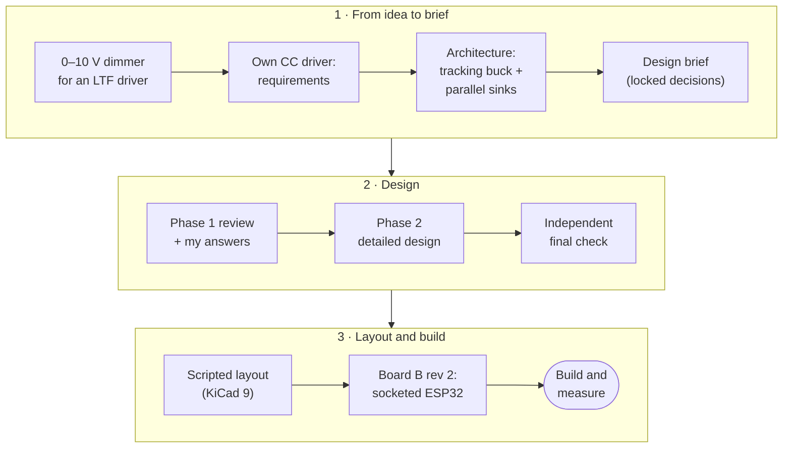
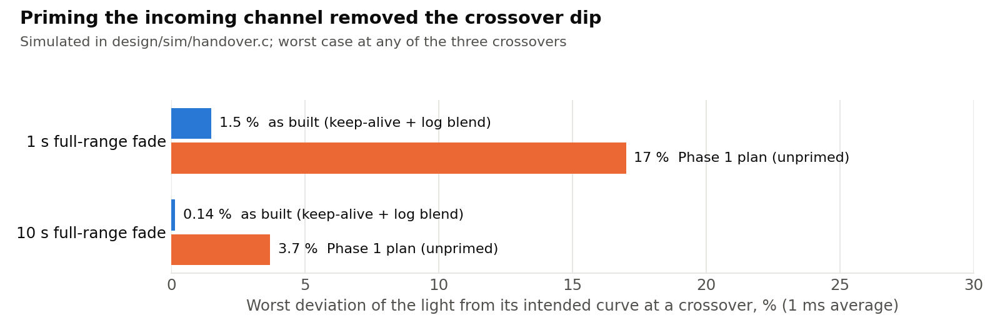
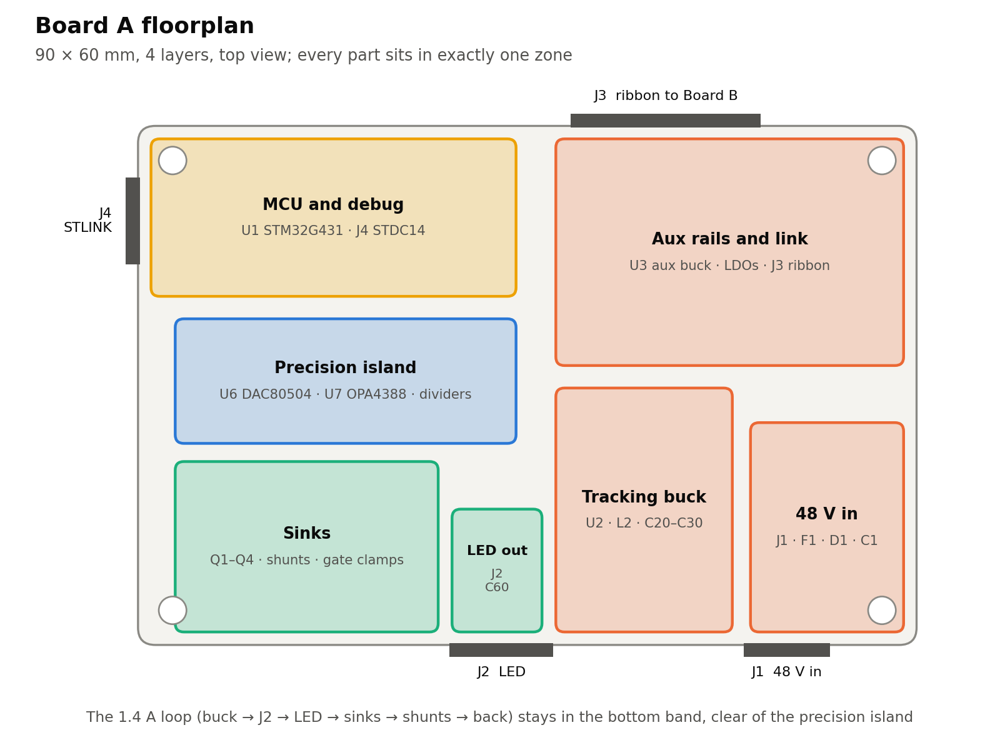

# Design process

How this went from "a dimmer for my Xicato fixtures" to a two-board, four-decade driver with its
own firmware and scripted layout, in the order it happened, with the reasoning at each turn.

I did this in collaboration with Claude. Claude assisted in firmware development and testing, documentation, and helped answer my questions regarding design practices.
The complete documents from the two design phases are in [`design-record/`](design-record/).

---

## 1. Where it started

I'm building four stage fixtures around the **Xicato XTM19803050CCA**: a 19 mm LES, 3000 K,
roughly 5000 lm module driven at up to 1.4 A. The first plan was modest: an ESPHome controller
putting out 0–10 V to an off-the-shelf constant-current driver.

Two requirements broke that plan:

- **Smooth dimming to 0.1% of full output.** 0–10 V interfaces are specified to about 1% at best,
  and most drivers bottom out well above 0.1%, so the end of every fade snaps to black.
- **Flicker-free on camera, including phone slow motion.** Cameras would be pointed at these
  fixtures. Most drivers dim the bottom of their range with PWM or drop into pulse-skipping at
  light load; a rolling shutter turns either into bands across the frame.

Neither can be fixed from outside the driver, so I dropped the 0–10 V stage and the commercial
driver and decided to build the constant-current driver myself: one board for the power and
current control, a separate ESPHome board for the controls, fed by an off-the-shelf isolated
48 V supply so that no mains voltage ever touches my boards.

## 2. Choosing an architecture

With cameras ruling out PWM, the whole range had to be analog, and 0.1% at the bottom means the
current-sense signal can't be allowed to shrink to nothing. Several ways to get there came up:

| Option | Verdict |
| --- | --- |
| One buck as the current source, with switched sense shunts | A buck at 0.1% load runs into its minimum on-time and pulse-skips into the audio band; the range switching is a glitch in every fade |
| Buck for the top, a linear sink for the bottom decade | Works, but adds a mode change and a second kind of handover |
| A dedicated current-source IC for the bottom (LT3092 and similar) | Less design work, but you inherit its accuracy and drift rather than choosing your own shunts |
| A second small buck in parallel | Two switchers, cross-conduction, and the small one still pulse-skips at its own bottom |
| **A tracking buck feeding linear sinks that do all the current control** | **Chosen** |

The chosen structure: the buck never regulates current. It holds the LED's anode about 1 V above
what the sinks need, so it drops out of the accuracy path entirely. The current is set by
**parallel linear sinks**, each with its own FET, op-amp and shunt straight to ground, one per
decade: 0.1 Ω for 140 mA–1.4 A, 1 Ω for 14–140 mA, 10 Ω for 1.4–14 mA. Every range sees the same
14–140 mV of sense voltage, so every range is equally precise. Parallel currents simply add, so
a range change is one channel ramping up while the other ramps down, with no FET in any sense
path and each FET sized for its own current.

Then the question "why stop at 1.4 mA?" Perceived brightness goes roughly as the square root of
luminance, so 0.1% of the light still looks like about 3% brightness, and the last step to black
is visible. Going a decade deeper makes the fade look like it disappears rather than switches
off. My brief did that with **PWM on the low channel for the bottom decade**, down to 140 µA
average.

### The brief

I wrote a detailed brief with the requirements and a set of "locked decisions" to design around:

1. An isolated 48 V module; **no mains voltage on either of my boards**.
2. A buck that may be asynchronous and pulse-skip, with a slow analog headroom loop and OVP
   around 40 V.
3. Three parallel linear sinks with Kelvin-sensed shunts.
4. A crossfade with hysteresis between ranges.
5. PWM on the low channel for the bottom decade.
6. A 16-bit quad DAC and a logarithmic curve.
7. An ESP32 running ESPHome on Board B, with an encoder, a push button and a sync button.

And one rule I care about more than any of them: **don't invent part numbers.** If a part can't
be confirmed to exist and be stocked, describe it so I can search for it. A wrong part number
costs a board revision.

## 3. Phase 1: the review that changed the plan

The first phase was a critique of the brief before any schematic existed. Three of the locked
decisions didn't survive analysis. The full review is
[design-record/phase1-review.md](design-record/phase1-review.md).

**Buck ripple reaches the LED even with ideal sinks.** Capacitance from the LED's cathode to
ground (the off channels' FETs, the leads, the module-to-heatsink path) has to be charged through
the LED whenever V_out moves, and no sink sees that current. At 140 µA the LED's dynamic
resistance is about 4.6 kΩ, so a pulse-skipping buck rippling 20 mV at 10 kHz would put 0.9%
flicker on the light by itself. **Fix:** a synchronous buck locked in forced PWM at a fixed
400 kHz, far above anything a camera or eye integrates.

**The case for PWM falls apart.** Off-channel leakage flows through the LED continuously, so its
error is the same whether the average comes from PWM or DC. And the LED doesn't really switch
off between pulses: the cathode capacitance keeps it conducting at microamps. Meanwhile PWM adds
pulse-charge errors that drift with the FET's threshold, beats with the buck, and phone banding
at short exposures. **Fix:** a fourth DC range, 100 Ω for 140 µA–1.4 mA: one small FET, one
precision resistor, and the fourth sections of the op-amp and DAC that were there anyway.
Below 140 µA it keeps dimming on calibrated offset to about 5 µA.

**A slow headroom loop can't follow a snap cue.** The LED's forward voltage rises with current,
so a snap from 10% to full would starve the sink until a slow loop caught up, then overshoot.
**Fix:** move the headroom loop into an MCU on Board A with feed-forward: it knows (and learns)
the forward voltage at every current, raises V_out *before* raising the current, and lowers the
current before V_out on the way down.

Smaller changes: a **100 W** supply instead of 60 W (the worst case is 56 W); a **static blend**
between ranges instead of hysteresis (a stateless blend has nothing to hunt); a **fast
comparator trip**, because a shorted LED doesn't "fall out" but puts all of V_out across the
active FET; a **V_out floor** so that off really is dark; and a **zero bias plus gate clamps**, so
DAC code 0 is reliably off. And one observation that shaped the calibration plan: the module's
own ±10% flux tolerance dwarfs the driver's accuracy, so matching fixtures needs a light gain per
fixture, not just matched current.

The real-time control went to an **STM32G431** on Board A, so fades, ranging, headroom and faults
stay deterministic and independent of Wi-Fi: a Wi-Fi stack crash can't leave the LED unsafe.

### My answers

The review ended with fourteen questions (I answered thirteen; the last kept its default). The
ones that shaped the design:

| Question | My answer | Consequence |
| --- | --- | --- |
| Fourth DC range and the other changes? | Yes | Built as proposed |
| Bench-test the XTM before layout? | Keep testing to a minimum; make assumptions where necessary | No pre-layout tests. The design assumes ≤50 nA of bypass inside the XTM, and the tail's end point is a firmware setting in case the last few µA misbehave |
| Enclosure? | Wood or plastic; metal only for heatsinking | An ESP32 with its own antenna; Board A cools through its own copper |
| Link lost to Board B? | Blink and drop to 20% | Board A blinks twice and settles at 20%; planned restarts hold the level |
| Sync button? | Toggling on makes every other fixture follow this one; ownership moves to whoever toggles on | ESP-NOW, fixture to fixture |
| Haze? | None | No conformal coating, but cleaning stays mandatory |
| Fixture matching? | Lux at a set distance at a couple of levels, if simple | Two-point light matching stored on Board A |
| DMX? | No | — |

## 4. Phase 2: the detailed design

Phase 2 put a value on every part, wrote both boards' firmware, and wrote the bring-up,
calibration and flicker procedures. The complete document is
[design-record/phase2-detailed-design.md](design-record/phase2-detailed-design.md).

### Every number from a script

Every value comes from [`design/calc.py`](../design/calc.py), which asserts the limits that
matter (loop phase margins, the buck's minimum on- and off-times, inductance, the V_out ceiling),
and from a time-domain model of a crossover, [`design/sim/handover.c`](../design/sim/handover.c).
Change a value, rerun, and anything that breaks fails loudly.

### The flaw the simulation found

Modelling the crossovers in the time domain turned up a real problem with the Phase 1 plan. A
channel sitting unused has its integrator wound down to 0 V. Before it can carry any current, its
output has to climb to the FET's threshold, about 2 V, at a rate set by a tiny error signal. So
during a crossfade the incoming channel lagged its setpoint through the whole band, and the
light dipped: about 3.5% on a 10-second fade and 16% on a 1-second one. Visible, and on camera.

The fix has three parts. **Keep-alive:** a channel about to be needed regulates a tiny current
(2.5 µA on the 10 Ω channel, for example), which parks its integrator at the FET's threshold,
ready to move; the MCU subtracts that current from the active channel. **Arming:** a channel arms
when the level passes half its band's bottom, or when a fade's trajectory will reach its band
within 0.4 s. **A log-domain blend:** inside a band, the ratio of the two channels' currents runs
linearly in log(I), so each channel's share grows exponentially, which a loop biased near
threshold can follow.

<picture>
  <source media="(prefers-color-scheme: dark)" srcset="images/crossover-dark.png">
  
</picture>

### Other changes that came out of the detail

- **A 22 nF capacitor across the LED.** It makes the cathode follow V_out at audio frequencies,
  so buck ripple barely reaches the LED current: the ripple allowed at the bottom of the range
  rose from about 6 mV to over 100 mV. With it in place the two bucks free-run instead of being
  synced to the MCU.
- **The MCU holds the main buck off whenever it's in reset**, so a crashed or unprogrammed MCU
  can't light the LED.
- **The buck's feedback network was rescaled**, because the STM32's buffered DAC can't swing
  within 0.2 V of its rails.
- **An ADC tap on each op-amp output**, so firmware sees when a channel is primed or short of
  headroom.
- **Off and on are sequenced, with a voltage-mode tail.** Below 5 µA the sink holds and V_out
  keeps falling instead, and the LED's current follows it exponentially down to picoamps. The
  final fade to black is continuous, with no last step.
- **The LED heatsink and the 48 V side stay unearthed.** A floating heatsink follows the array's
  voltage, which keeps its capacitance out of the ripple path.

### Schematics as code

Instead of drawing schematics, every part and every pin-to-net connection is declared in Python
([`design/board_a.py`](../design/board_a.py), [`board_b.py`](../design/board_b.py)), with the
part data in [`catalog.py`](../design/catalog.py). One command regenerates the netlists, BOMs and
sheet tables and runs a connectivity check. That gave one source of truth for connectivity, a
check on every build, and a design that doesn't depend on a particular KiCad version's schematic
format. Anyone who wants a drawn schematic can capture it from the sheet tables and prove it
matches with `compare_netlists.py`.

### Firmware, tested before there's hardware

Board A's firmware splits into `src/core` (the curve, calibration, blend, fade engine, LED model,
framing, parameter storage: no registers) and `src/hw`. The core runs on a PC under
AddressSanitizer: 97,146 checks. Board B's ESPHome component is tested the same way, and
end-to-end: ESPHome's Linux build runs the component against a simulated Board A on a
pseudo-terminal, driven through the same native API Home Assistant uses.

### Testing kept to a minimum, by design

Per my answer, nothing gets measured before layout. The design instead states its assumptions
about the XTM (a low-current slope near 0.65 V per e-fold, at most about 50 nA of internal
bypass, 0.3–1 nF on the cathode) and makes the one thing that depends on them, the tail's end
point, a setting. The bring-up procedure is seven steps, each with a pass line, that prove the
board is safe and the loops behave; calibration and a flicker check catch the rest.

## 5. The independent final check

Before calling Phase 2 done, every part number was checked against a distributor or
manufacturer page, and then a separate, independent pass went over the whole design against the
datasheets, looking for mistakes rather than improvements. Between them they changed these,
several of which would have cost a board revision:

| Found | Changed |
| --- | --- |
| The DAC80504's 2.5 V reference, undivided, sits exactly at the datasheet's VDD/2 limit on a 5 V supply, where a reference alarm turns every output off | Reference halved and gain doubled (REFDIV and GAIN strapped high), full scale unchanged; the footprint corrected to TI's RTE0016D with its 0.8 mm pad |
| The buck enable was on PB9, which the STM32's ROM bootloader uses as its CAN transmit pin, idling high: the buck would have started during a reflash | Moved to PC13, with a pull-down |
| No distributor stocked the WSK2512 0.1 Ω shunt | The two-terminal WSL2512 named as a same-pads fallback, with its effect on the error budget |
| ST's STDC14 header part has alignment pins that need holes the footprint lacks | FTSH-107-01-L-DV-K instead of -K-A |
| LCSC's encoder is the knurled-shaft variant; a chosen electrolytic was a 12.5 mm can; two LEDs were out of stock; a ferrite rated 500 mA sat on a 600 mA rail | BOM corrected, each replacement verified |
| The thermal estimate used a generic board | Recomputed on the real 90 × 60 mm outline and copper: about 127 °C FET junction in 45 °C air, against 150 °C |
| — | Encoder footprint with round lug holes; tactile switch footprint that current KiCad versions still ship |

Every part number in the BOMs now carries a status saying where and when it was verified, and the
parts that don't need a specific maker are listed by description.

## 6. Layout by script

I use KiCad 9 on Windows, and I wanted a layout I could regenerate after any change rather than a
one-off drawing. So the layout is done by Python scripts running inside KiCad 9 (see
[`layout/`](../layout/)): they place every part, draw the copper that decides whether the board
works, route the rest with Freerouting, pour and stitch ground, check everything with KiCad's
DRC and a set of custom rules, and export JLCPCB's files. The rules they follow are written down
in [`hardware/LAYOUT.md`](../hardware/LAYOUT.md), which doubles as the review checklist.

Getting both boards to **0 DRC errors and 0 unconnected** took solving a series of problems:

- **Router version.** Freerouting 2.1 left over a hundred connections open on Board A and ignored
  its pass limit; 1.9.0 leaves a handful and is pinned.
- **The router cut through copper that matters.** Q1's heat-spreading "tab" copper is on the LED
  cathode net, and the router happily ran other tracks through it. The scripts now pass keep-out
  areas to Freerouting.
- **No room left for ground vias.** After routing, 83 ground pads had nowhere to put a via to the
  plane. The scripts now fan out a via beside every ground pad *before* routing, with the track
  width adapted to each pad.
- **Router crumbs.** Dangling stubs and vias connected to nothing, removed automatically from the
  DRC report.
- **Missing pour.** KiCad removed "island" pour fragments before the stitching vias that would
  have connected them were placed; island removal is now off while stitching.
- **A connectivity bug in my own tools.** Two pads with the same number on one part (a switch's
  pad 2, twice) were treated as joined when KiCad doesn't join them; pads are now tracked by
  their unique IDs.
- **High-voltage spacing.** A blanket 0.6 mm clearance on the 48 V nets walled the buck's enable
  pin in. The rules now follow IPC-2221B's table for 51–100 V properly: 0.5 mm where a bare pad is
  involved, 0.3 mm between coated tracks and on inner layers.
- **Layer use.** Routing about 200 parts on the outer layers alone left too many connections
  open, so the third layer carries signals too, with the second a solid, unbroken ground plane.
- **Heat.** The channel-1 FET dissipates 1.2 W with no heatsink. The layout gives it 2.3 cm² of
  copper on top, 2.8 cm² on the bottom and 39 vias between them.

Board A now routes completely on the first attempt in about four minutes; Board B in under one.

<picture>
  <source media="(prefers-color-scheme: dark)" srcset="images/floorplan-dark.png">
  
</picture>

## 7. Board B, revision 2: a socketed module

The first Board B carried a bare ESP32-S3-WROOM-1 module with its own USB-C connector, ESD
protection, 3.3 V regulator and reset circuit. The USB-C receptacle (0.5 mm pitch) was the
hardest part to hand-solder on either board and the one the router struggled with most. So I
looked at the alternatives:

| Option | For | Against |
| --- | --- | --- |
| WROOM module on the board (as designed) | Smallest, cleanest | The fiddly USB-C and support parts; a dead module means desoldering |
| A pre-built dev board SMD-soldered flat | Fewer parts | Still soldered in; castellations are hard to inspect or rework |
| **A dev board with male headers in female sockets** | 17 fewer parts, no USB-C to solder, a ten-second swap, flashed off the board | Height; the module's own quirks |

The **Waveshare ESP32-S3-Zero-M** won: ESP32-S3 with 4 MB flash and 2 MB PSRAM, its own USB-C,
regulator and buttons, a ceramic antenna, and 2.54 mm edge pins with headers already fitted.
Its trade-offs shaped the board:

- On its sockets it stands 12–14 mm tall, and the operator panel sits a few millimetres above
  Board B's top side, on the encoder's nut. So the sockets are on the **back**.
- Its 5V pin is its USB supply, with no diode. A Schottky keeps USB power out of Board A, but
  nothing keeps Board A's supply out of a computer, so the module is **flashed out of its
  sockets**.
- It fits turned round, which would put 5 V on a GPIO, so the back silkscreen names both ends
  and marks pins 1 and 18.
- Its footprint is this project's own, drawn from Waveshare's figures and cross-checked against
  a community footprint and product photos, so the build guide asks for a 1:1 print check.
- The link to Board A moved to IO1/IO2, keeping UART0 (which the boot ROM talks on) off Board A's
  line; IO3, a strapping pin, is left spare.

## 8. What I'd pass on

- **Write requirements as numbers you can measure.** "0.1%", "nothing over 1% from 100 Hz to
  20 kHz", "240 fps". Every decision after that was checked against them.
- **Let a review challenge the locked decisions.** Three of mine were wrong, and the reasons
  were physics, not taste.
- **Model the dynamics, not just the static values.** The crossover dip was invisible in every
  steady-state calculation.
- **Keep one source of truth for connectivity**, and check it on every build.
- **Verify every part number on the day, and describe what you can't.** The final check still
  found a wrong can size, a wrong shaft and a connector variant that wouldn't fit.
- **Automate the rules you care about, then review what rules can't see.** DRC-clean isn't the
  same as right; the build guide's review list is the other half.
- **Minimise testing up front, but design the procedures so that a wrong assumption shows up at
  bring-up**, with a setting to adjust rather than a board to respin.

## 9. What's next

1. Build the first set and run bring-up; the procedures are written to fail early and clearly.
2. Measure what the design assumed about the XTM at microamp currents (its low-current slope,
   internal bypass and cathode capacitance) and set the tail's end point from it.
3. Calibrate, then verify flicker with the photodiode rig and a phone at 240 fps.
4. Run the ESP32-S3 build in CI (the workflow in `.github/workflows/` does it).

Improvements on the list, none needed for a first build: a matched divider network (it would
restore Phase 1's tighter error budget), 10 ppm/°C shunts, routing each Kelvin pair side by side
by hand, a larger Board A outline for thermal margin, and a bootloader client on Board B so it
can reflash Board A over the ribbon (the ribbon already carries BOOT0 and NRST for it).
