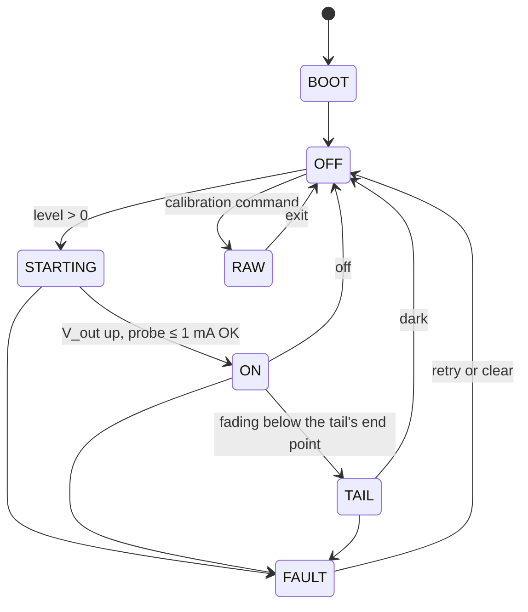
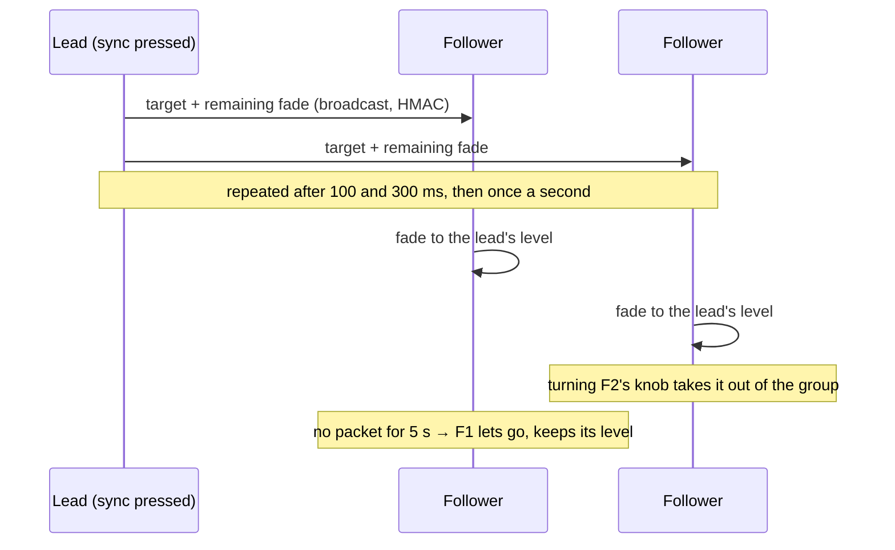

# Firmware reference

Two firmwares: bare-metal C on Board A's STM32G431, which owns everything real-time, and an
ESPHome configuration with one external component on Board B's ESP32-S3, which owns the level
and the user interface. They talk over a framed UART on the ribbon.

Build and flash steps are in the [build guide](BUILD_GUIDE.md#10-build-the-firmware); each
firmware folder has its own README with the details
([Board A](../firmware/board-a/README.md), [Board B](../firmware/board-b/README.md)).

## Board A: STM32G431, C on ST's LL drivers

50–58 KB of the 126 KB of flash depending on the toolchain, built with CMake and arm-none-eabi-gcc
12 or later.

### Structure

| Path | What |
| --- | --- |
| `src/main.c` | Start-up order and the main loop |
| `src/app/control.c` | The controller: 4 kHz tick, fault handling, headroom learning, blink sequences |
| `src/app/link.c` | Board B protocol and link-loss handling |
| `src/app/console.c` | Bring-up and calibration console on the STLINK's virtual COM port |
| `src/app/settings.c` | Parameters settable from Board B or the console |
| `src/core/` | Portable logic, covered by the host tests: brightness curve and light matching, channel calibration and blend, fade engine, LED model, framing, parameter storage |
| `src/hw/` | Everything that touches a register: ADC, DAC and comparator, the DAC80504, flash, UARTs |
| `third_party/` | CMSIS, the STM32G4 device files and LL headers, with their licences |
| `tests/` | Host tests for `src/core` (97,146 checks, AddressSanitizer and UBSan) |
| `tools/calibrate.py`, `tools/flicker.py` | Calibration over the console; flicker analysis of scope captures |

### States

### The 4 kHz control tick (TIM6)

1. **Advance the fade.** A fade moves the position `b` on the brightness curve linearly in time,
   which is a constant rate in log(current). Snaps complete within 5 ms; fades run up to
   10 minutes.
2. **Split the current across the four sinks:** the log-ratio blend inside each crossover band,
   keep-alive currents on armed channels (subtracted from the active one), and arming ahead of a
   fade that will reach a band within 0.4 s.
3. **Write the DAC80504 codes** under a monotonic guard, through each channel's calibrated model.
4. **Lead or lag V_out:** rising current waits for V_out; falling current goes first. V_out's
   target is the learned forward voltage at that current plus headroom (1.0 V at full current,
   0.7 V at low current).

Below the tail's end point (5 µA by default) the sink holds and V_out keeps falling: the
voltage-mode tail that takes the light smoothly to dark.

### Protection

| Condition | Detection | Response |
| --- | --- | --- |
| Shorted LED | COMP1 on the cathode tap (3.0 V, masked while a turn-on is leading); V_out − V_cathode under 15 V | All four gate clamps from the comparator's interrupt in about 1 µs |
| Open LED | V_out at its ceiling with the cathode near 0 V for 200 ms (in practice only near full output: see [known issues](#known-issues)) | V_out to the floor |
| Undervoltage | 48 V under 40 V for 20 ms | Off until it recovers |
| Buck | Power-good lost | Fault |
| Over-temperature | Four NTCs: derate from 95 / 90 / 90 / 75 °C, trip 15 °C higher | Derate, then off until cool |
| DAC | Register read-back every few ms (the reference alarm included) | Fault |
| Firmware | 50 ms independent watchdog; the buck held off in reset | Restart into a safe state |

**Fault policy:** short and open retry three times, 5 s apart, then latch until cleared (console
`clear` or Home Assistant's Clear fault button). Undervoltage and over-temperature clear by
themselves.

### Background work

16× oversampled ADCs on DMA; headroom learning every 10 ms into a 12-bin forward-voltage table;
the link; the console; the status LED (D4); a deferred flash write.

### Storage

The last 2 KB flash page: magic `XTM1`, format version 1, CRC-32. It holds per-channel
calibration points, the dark current, the curve's end points, the link-loss level, the light
calibration and fleet reference, headroom settings and the learned forward-voltage table. A write
waits until the light is off or under 10 mA and not fading, because erasing flash stalls the CPU
for about 20 ms. A bad CRC at boot loads defaults and clears the Calibrated flag.

### Settings

Settable from Home Assistant or the console (`set id value`, `get id`, `params`):

| Id | Setting | Default |
| --- | --- | --- |
| 0 | Link-loss level, 0–1 on the brightness scale | 0.2 |
| 1 | Bottom of the curve (tail end point), amps | 5 µA |
| 2–5 | Light calibration: two (amps, lux) points | — |
| 6 | Fleet reference lux at full scale (0 = match on current) | 0 |
| 7, 8 | Headroom, high and low current | 1.0 V, 0.7 V |
| 9 | Full-scale current, amps (≤ 1.4) | 1.4 |
| 10 | Link timeout, seconds | 1.5 |
| 11 | Mean learned V_f correction (read-only) | — |
| 12 | This fixture's lux at full scale (read-only) | — |

The console commands are listed in the [build guide](BUILD_GUIDE.md#appendix-b-board-a-console).

## The link between the boards

UART at 115200 8N1 over the ribbon. Each frame is `[type][seq][payload][CRC-16]`,
COBS-encoded and terminated by 0x00, with CRC-16/CCITT-FALSE over type to payload. It's defined
once, in [`src/core/link_protocol.h`](../firmware/board-a/src/core/link_protocol.h), and Board B
carries a verbatim copy; its tests fail if the copies drift.

| Message | Direction | Payload |
| --- | --- | --- |
| SET_LEVEL | B → A | Level 0–65535 (0 = off), fade time in ms |
| PING | B → A | None; Board B sends one every 200 ms |
| HOLD | B → A | Seconds to ignore link silence (a planned restart or OTA) |
| CLEAR_FAULT | B → A | None |
| IDENTIFY | B → A | Blink count |
| SET_PARAM, GET_PARAM | B → A | Parameter id, value, save flag |
| STATUS | A → B | Every 100 ms and after each command: target and current level, state, fault, flags, LED current and voltage, V_out, 48 V, four temperatures, firmware version, uptime, `level_link` |
| ACK, PARAM | A → B | Result; a parameter's value |

**Who owns the level.** Board B does. Board A echoes the last level it received from Board B in
every STATUS (`level_link`), so Board B re-sends only when that shows a problem: a lost frame,
Board A restarted, or Board A's link-loss fallback. A level typed on Board A's console stands
until Board B next changes the light.

**Link loss.** If Board A hears nothing for 1.5 s it blinks twice and drops to the link-loss
level (20%, or stays put if already lower; a blacked-out fixture stays dark). A planned Board B
restart sends HOLD first, so the light doesn't move; after a crash Board B restores the previous
level when it's back. When Board B starts and finds Board A already running, it adopts Board A's
level, so an OTA update never changes the light.

## Board B: ESPHome on the ESP32-S3-Zero

`firmware/board-b/xtm-common.yaml` is the device, shared by all four fixtures; `xtm-1.yaml` to
`xtm-4.yaml` set each one's name and API key. ESPHome 2026.9.0 or later, ESP-IDF framework.

### The `xtm_driver` external component

| File | What |
| --- | --- |
| `link_client.*` | The Board A link: framing, pings, level ownership, start-up, retries. No ESPHome code, so it's unit-tested on a PC |
| `sync_core.*` | The group sync logic, also ESPHome-free and unit-tested |
| `xtm_driver.*`, `xtm_light.*`, `xtm_entities.h`, `xtm_sync.*`, `xtm_wire.*` | The ESPHome glue: the hub, the light, entities, the ESP-NOW transport |
| `link_protocol.h`, `frame.h`, `frame_c.h` | Verbatim copies of Board A's files |
| `*.py` | ESPHome's code generation for each platform (light, sensor, number, switch, button...) |

**The light.** One dimmable light. Brightness goes to Board A as a 16-bit level on Board A's own
curve (so `gamma_correct` is 1.0), and a transition goes as a single "fade to X over T ms"
command that Board A runs. ESPHome's loop timing never touches the light.

**The knob.** One detent is 1% of the scale as an 80 ms fade, ×2 or ×4 when spun fast; up from
off starts at the bottom, down stops there. The push toggles with a 400 ms fade.

**Status LED** at 25 kHz, dimmed; the patterns are in the
[build guide](BUILD_GUIDE.md#the-status-led-on-board-b).

### Group sync over ESP-NOW

Press sync on any fixture and it becomes the lead; press it on another and the lead moves there;
press it on the lead to end the group. Every packet carries an HMAC-SHA256 tag under the shared
`sync_key`, so other groups and anyone else's radio are ignored. ESP-NOW uses the Wi-Fi radio's
channel, so all fixtures in a group must be on the same access point. A fixture that restarts
while a group is running rejoins it.

### Entities

Light; LED current and voltage; driver output and 48 V input voltages; four temperatures; driver
state, fault, sync role and firmware; link, derating, calibrated and light-matched flags; clear
fault, identify and restart buttons; Board A's settings (link-loss level, bottom current,
full-scale current, fleet reference light, link timeout); a Sync lead switch.

### Tests

| Test | Checks |
| --- | --- |
| `make -C tests` | 89: the link client and sync logic, including 30% packet loss |
| `tests/host/run_host_test.py` | 43, end to end: ESPHome's Linux build of the component against a simulated Board A on a pseudo-terminal, driven through the native API as Home Assistant does (transitions, knob, settings, a lost frame, a Board A reset, link silence, planned and unplanned restarts, power-up restore) |
| `tests/host/check_sync_glue.py` | Compiles the ESP-NOW glue against ESPHome's real headers |

## Known issues

Found while checking the documentation against the code; not yet fixed, and nothing here has run
on hardware yet.

- **An open LED is only detected near full output.** The open-LED check needs V_out at its 38 V
  ceiling, but V_out follows the learned LED model, whose correction is limited to +8 V. At low
  levels the target never reaches the ceiling (about 31 V at `b 0.3`), so an open output just sits
  there with no fault; above roughly 0.9 A it's caught as designed. That's why bring-up step 4
  uses `b 1`.
- **Corrections learned with the LED disconnected persist.** While the output is open the
  headroom learner keeps raising the forward-voltage correction for that current, up to +8 V. It
  stays in RAM (and would be written to flash by the next `save` or settings change), and the
  next start at that current then sees the cathode far too high and reports a short. A `reboot`
  clears it as long as nothing was saved.
- **Possible fix:** treat "correction at its +8 V limit and the cathode still starving" as an open
  LED at any level, and clear the learned corrections when an open-LED fault is raised.

## Not written yet

Reflashing Board A from Board B. The ribbon carries BOOT0 and NRST for it and the component
already drives both (the Restart driver button pulses NRST), but the STM32 bootloader client
isn't written: flash Board A with the STLINK.
