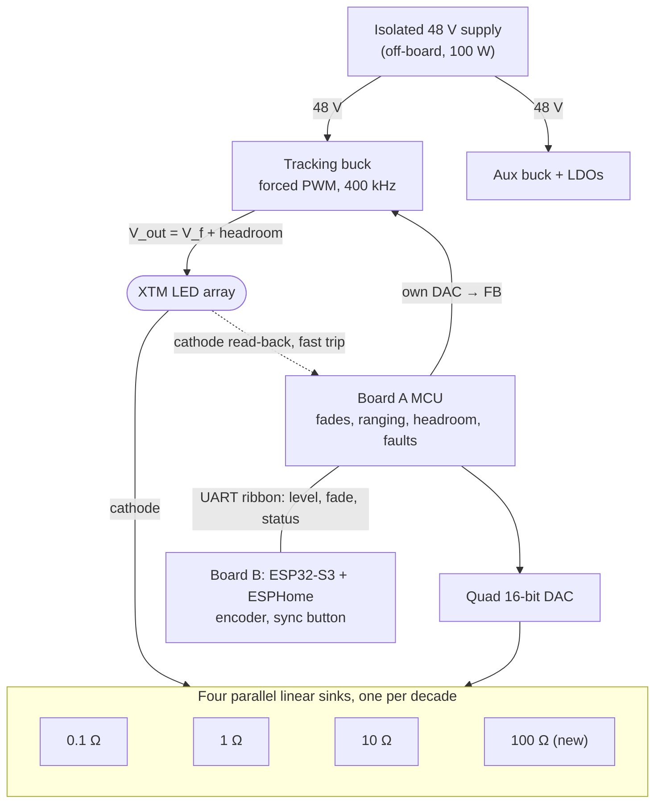

# 4-decade LED driver — Phase 1 design review

26 September 2026

> **About this document.** This is the Phase 1 design review as it was written, before any
> schematic existed: Claude's critique of my original brief, addressed to me, with my answers to
> its questions recorded at the end. It's kept as a record of *why* the design looks the way it
> does. The Phase 2 design ([phase2-detailed-design.md](phase2-detailed-design.md)) supersedes it
> wherever the two differ, and the files in the repository supersede both. Section numbers like
> "3.2" refer to sections of my brief.

## Summary

The architecture is sound, but three locked decisions should change before layout. The biggest is PWM for the bottom decade: both of its stated benefits fail on analysis, and a fourth DC range does the job better.

1. **Forced-PWM buck, not pulse-skipping.** Capacitance at the LED cathode turns audio-band V\_out ripple into LED current that no sink sees: 20 mV at 10 kHz is 0.9% flicker at 140 µA.
2. **A fourth DC range (100 Ω) instead of PWM.** Leakage error is I\_leak / I\_avg either way, and the cathode's capacitance keeps the LED conducting at microamp levels between pulses regardless. DC puts no intentional modulation on the LED and fades smoothly to about 5 µA.
3. **Headroom control moves into the Board A MCU, with feed-forward.** A slow loop can't follow a snap cue; the MCU raises V\_out before it raises current.
4. **Smaller changes:** a 100 W supply instead of 60 W (worst case is 56 W); a static blend instead of hysteresis; a fast comparator trip, because a shorted LED puts all of V\_out across the active FET; a \~3 V floor on V\_out so "off" is truly dark; and a zero bias plus gate clamps so code 0 really means off.

After calibration every range holds about ±0.05–0.08% RSS (±0.15% worst case), and 140 µA holds ±0.08% plus whatever the XTM leaks internally. The module's own ±10% flux tolerance dwarfs that, so the driver's precision buys smoothness and monotonicity; matching fixtures needs one light gain each.

Your answers are recorded below. The detailed design continues in the Phase 2 doc, which supersedes this review where the two differ.

## Block diagram



Board A owns every real-time decision: it sets V\_out ahead of each current change, reads the cathode node back, and runs the fades. Only a level, a fade time and status cross the ribbon to Board B. The mains never touches either board.

## Critique of the locked decisions

Three locked decisions should change before schematic capture: the buck must not pulse-skip, the bottom decade should be a fourth DC range instead of PWM, and the headroom loop should run in the Board A MCU with feed-forward. The rest stand, with the notes below.

| Locked decision | Verdict | Why, in one line |
| --- | --- | --- |
| 3.1 Isolated 48 V module, no mains on the boards | Keep; raise the rating to 75–100 W | Worst-case load is \~56 W before temperature derating |
| 3.2 Buck may be asynchronous and pulse-skip | Change: synchronous, forced-PWM, fixed frequency | Audio-band V\_out ripple reaches the LED through cathode-node capacitance |
| 3.2 Slow analog headroom loop with a DAC reference | Change: digital loop in the MCU, with feed-forward | A slow loop can't follow snap cues |
| 3.2 OVP \~40 V, soft-start, shorted LED "falls out" | Keep OVP and soft-start; add a fast comparator trip and a \~3 V V\_out floor | A short doesn't fall out: all of V\_out lands across the active FET |
| 3.3 Three parallel linear sinks | Keep; add a zero bias and gate clamps; accept ±35 ppm/°C on the 0.1 Ω shunt | DAC code 0 is not reliably "off"; the best four-terminal 0.1 Ω part I found is ±35 ppm/°C |
| 3.4 Crossfade with hysteresis | Keep the crossfade; drop the hysteresis | A static blend has nothing to hunt |
| 3.5 PWM on the low channel for the bottom decade | Change: a fourth DC range, 100 Ω | Both stated benefits fail; PWM adds flicker risk |
| 3.6 16-bit quad DAC, log curve | Keep; the DAC serves four sinks | The buck setpoint moves to the MCU's own DAC |
| 3.7 ESP32 + ESPHome on Board B | Keep | See the ESPHome section |

### Buck ripple reaches the LED even with ideal sinks

The sinks hold their own currents, but capacitance from the LED cathode to ground outside the active loop — off-channel FET C\_oss, the leads, the module-to-heatsink path — must be charged through the LED whenever V\_out moves. That displacement current flows through the emitting junctions, and no sink sees it.

```latex
i_{LED} \approx 2\pi f\,C_n\,v_{out}\quad (f \ll f_c),\qquad f_c = \frac{1}{2\pi r_d C_n},\qquad r_d = \frac{n\,N\,V_T}{I}
```

With C\_n ≈ 1 nF and nNV\_T ≈ 0.65 V (about ten dies in series, ideality \~2.5), r\_d is 4.6 kΩ at 140 µA and f\_c is about 34 kHz. A pulse-skipping buck that ripples 20 mV at 10 kHz pushes 1.3 µA through the LED: 0.9% of 140 µA, the whole flicker budget from one source.

- "Ripple stays inside the headroom margin" is necessary but not sufficient. At the bottom of the range the limit is ripple amplitude times frequency.
- Fix: a synchronous buck locked in forced-PWM at a fixed ≥400 kHz, so ripple sits far above 20 kHz, plus a small output LC stage.
- At the switching frequency the cathode node is effectively grounded, so the LED sees v\_out / (nNV\_T): about 1.5% at 400 kHz for 10 mV of ripple before the LC stage. That is out of band, and the LC stage takes it below 0.1%.
- Keep C\_n small. A small-die high-channel FET helps here and with leakage.

### The PWM rationale does not survive, so use a fourth DC range

Both stated reasons for PWM fail once the off-phase is modeled.

1. **Leakage.** Off-channel leakage flows through the LED continuously, off-phase included. Its error is I\_leak / I\_avg in either scheme: 1 µA is 0.7% at a 140 µA average whether that average comes from PWM or DC.
2. **"The LED only sees ≥1.4 mA."** When the sink turns off, the LED keeps conducting while it charges C\_n. The current decays as I₀ / (1 + t/τ), with τ = C\_n·nNV\_T / I₀ ≈ 0.46 µs.

```latex
Q_{tail} = I_0\,\tau\,\ln\!\left(1 + \frac{T_{off}}{\tau}\right) \approx 1.4\,\text{mA} \times 0.46\,\mu\text{s} \times \ln 79 \approx 2.8\,\text{nC}
```

That is half the 5.6 nC delivered per pulse at 25 kHz and 10% duty, spread over currents from 1.4 mA down to microamps. The array does run in the microamp regime.

PWM also costs something:

- **Pulse-charge error.** Gating the reference loses roughly 0.5 µs per pulse while the op-amp leaves its negative rail and slews to V\_th. That is \~12% of a 4 µs pulse, and it drifts with V\_th's tempco.
- **Phone banding.** At 1/8000 s a sensor row integrates about three 25 kHz periods, so rows can differ by up to \~30% of this fixture's light.
- **Interactions.** The buck beats against the PWM unless it's synced, and the headroom loop must sample in step with the pulses.

The fourth range is a 100 Ω shunt covering 140 µA–1.4 mA at the same 14–140 mV sense voltage.

- Cost: one small FET, one precision resistor, the quad op-amp's fourth section, and the DAC's fourth channel. The headroom loop no longer needs either, because it moves into the MCU.
- The LED is DC at every level: no intentional modulation, and no phone banding.
- Below 140 µA it keeps dimming on calibrated offset to about 5 µA before switching off, so the last step is 28× smaller than the 0.01% one PWM would leave. At 5 µA the lens still glows faintly if you look straight into it, but the light it throws is negligible.
- One genuine argument for pulsing remains. The blue pump's spectrum shifts with current density, so CCT at 140 µA DC may differ slightly from 1.4 mA pulses. On a remote-phosphor module I expect this to be small; bring-up checks it against the phone's white balance.

If you keep PWM, I'd build it with current steering (the 1.4 mA sink never turns off; a make-before-break FET pair diverts it), a buck clock synced to the PWM, and headroom sampled at the end of each on-phase.

### A slow headroom loop can't follow snap cues

The datasheet's typical V\_f rises from 27.9 V at 500 mA to 29.9 V at 1.4 A, and further from 140 mA. A snap from 10% to full would bottom out the high-channel sink until a slow loop caught up. The cue would lag, then overshoot as the op-amp recovers from saturation.

- The Board A MCU raises V\_out first, to a learned V\_f(I, T) plus headroom, waits 1–2 ms, then ramps current. Going down, it lowers current first, then V\_out.
- A slow integral trim (\~1 Hz) only corrects the V\_f model, so the loop stays much slower than the sinks.
- The MCU reads the cathode node through a high-impedance path, never a resistive divider: a 1 MΩ divider at 1 V steals 1 µA, or 0.7% at 140 µA.
- The MCU's own DAC sets V\_out through FB injection, arranged so an MCU in reset (DAC pin high-impedance) drops V\_out to its \~3 V floor and the LED goes dark.

### OVP, open LED, shorted LED, and "off"

- **Open LED.** The sinks pull the cathode to 0 V and the loop drives V\_out to its ceiling. The FB network makes \~39 V the highest V\_out that can be commanded; a TVS covers transients, and firmware flags "V\_out at ceiling, no headroom".
- **Shorted LED.** This doesn't fall out naturally. The sinks still limit current, but all of V\_out (\~31 V) lands across the active FET: about 43 W at full output. An on-chip comparator watches the cathode against a threshold firmware sets just above the expected headroom, and trips the gate clamps within microseconds. Retries run with V\_out at its \~3 V floor, where the FET sees at most 1.4 A × 2.9 V ≈ 4 W, and firmware reports the short once V\_f reads under 15 V.
- **Off.** If V\_out stays at operating voltage, 10–100 nA of off-channel leakage keeps the module faintly lit, which shows in a blackout. Off means every sink off and V\_out at its floor.

### Sinks: keep, but zero code is not reliably off

- The DAC80504's zero-code error (0.5 mV typical, 1.5 mV max) is 33–100 µV after the divider. With op-amp offset, that leaves the 0.1 Ω channel conducting 0.3–1 mA at code 0.
- Fix: a deliberate \~+200 µV bias on each inverting input so code 0 is firmly off, plus a gate-clamp FET per channel that defaults on while the MCU is in reset. Calibration absorbs the bias.

### Handover: keep the crossfade, drop the hysteresis

Make the split a fixed function of the total current: all on the lower channel below the band, all on the upper channel above it, a linear blend inside. With no state there is nothing to hunt, so hysteresis has no job.

- The blend stays monotonic unless the two channels' gains disagree by about 6% in opposite directions. After calibration they agree to \~0.05%.
- Bands at 1.4–1.6 mA, 14–16 mA and 140–160 mA: each lower channel runs to 160 mV of sense, and the upper channel starts from zero.

### Absolute accuracy is set by the module, not the driver

The XTM's lumen output is ±10% of typical ([datasheet](https://www.xicato.com/wp-content/themes/xicato/documentuploads/DS%20XTM%20Standard%20Series%20062723.pdf)), so four fixtures at identical current can differ by up to 20% in light. The driver's \~0.05% matters for smoothness and monotonicity. For fixture matching, store one light-output gain per fixture, measured with a photodiode.

## Questions for you

Your answers, from 26 September. Question 14 went unanswered, so its default stands.

| # | Question | Your answer |
| --- | --- | --- |
| 1 | Replace PWM with a fourth DC range (100 Ω, 140 µA–1.4 mA)? | Yes |
| 2 | Accept the other changes: forced-PWM buck, digital headroom loop with feed-forward, 100 W supply, no hysteresis, and a ±35 ppm/°C four-terminal 0.1 Ω shunt? | Yes |
| 3 | Can you run the five-step XTM bench test before layout? | Yes, but keep testing to a minimum, so assumptions replace the tests |
| 4 | Is the fixture enclosure metal, and is the chassis or LED heatsink earthed? | Wood or plastic; metal only where heatsinking needs it; earthing if required |
| 5 | How far is Board A from the XTM and from Board B, and is there chassis area for a gap pad? | No fixed distances; the physical form is flexible |
| 6 | What is the fastest cue you need, and the slowest fade? | My call, without going to extraordinary lengths |
| 7 | Maximum air temperature inside the fixture, and is haze or fog used? | No haze or fog; temperature depends on the material, from common 3D-printing plastics to laser-cut stock |
| 8 | Venue network: one access point? Home Assistant? Standalone operation? | Default: one access point, Home Assistant usually present, every fixture fully standalone |
| 9 | What should the sync button do? | Toggling on makes every other fixture match this one; ownership moves to whoever toggles on |
| 10 | On losing the link to Board B, hold the last level or fade out? | Blink and drop to 20% |
| 11 | Do you want a footprint for a future DMX512 input? | No |
| 12 | What test gear do you have? | A university electronics lab's bench equipment |
| 13 | Match fixtures on current only, or also store a light gain per fixture? | Lux at a set distance and a couple of levels, if that stays simple; otherwise current only |
| 14 | Mains: US 120 V, with a fused IEC inlet and the supply inside each fixture? | Not answered; the default (yes) stands |

## Error budget per range

After per-channel gain and offset calibration, every DC range holds about ±0.05–0.08% (RSS) of reading, ±0.15% worst case, with the board within ±20 °C of its calibration temperature. The bottom of the 100 Ω range adds leakage; absolute light is limited by the module's ±10% flux tolerance, not by the driver.

The DAC80504 runs at gain 1 (2.5 V full scale) into a ÷15 matched divider, so every range sees 0–167 mV of sense and one LSB is 2.54 µV. Each range spans codes of roughly 5,500 (14 mV) to 63,000 (160 mV).

**Offset-type errors** (µV at the sense node, fixed in size, so worst at the bottom of each range):

| Source | Budget | At 14 mV sense | At 140 mV sense |
| --- | --- | --- | --- |
| Op-amp offset drift, budgeted at 10× the OPA4388's 0.005 µV/°C typical, over 20 °C | 1.0 µV | 0.007% | 0.0007% |
| DAC INL left after a 2-point calibration (±1 LSB max) | 2.5 µV | 0.018% | 0.0018% |
| DAC offset drift, ±1 µV/°C per the datasheet with 1.5× margin, over 20 °C, ÷15 | 2.0 µV | 0.014% | 0.0014% |
| Thermal EMF at shunt terminations (2 µV on the 0.1 Ω channel) | 1.0 µV | 0.007% | 0.0007% |
| Op-amp bias current (≤500 pA) into \~1 kΩ | 0.5 µV | 0.004% | — |
| **RSS** | **3.5 µV** | **0.025%** | **0.0025%** |

**Gain-type errors** (ppm of reading, the same at every level in a range):

| Source | Budget |
| --- | --- |
| DAC80504 reference, 5 ppm/°C max (2 typical), plus its 1 ppm/°C gain drift, over 20 °C | 120 ppm |
| Divider ratio tracking, ≤5 ppm/°C matched network, over 20 °C | 100 ppm |
| 1, 10 and 100 Ω thin-film shunts at ±25 ppm/°C over 20 °C | 500 ppm |
| 0.1 Ω WSK2512 four-terminal strip, ±35 ppm/°C guaranteed, over 20 °C | 700 ppm |
| 0.1 Ω self-heating at 1.4 A (196 mW, about +12 °C): 410 ppm raw, \~100 ppm after a quadratic calibration term | 100 ppm |

With ±10 ppm/°C thin-film parts the 1–100 Ω shunt line drops to 200 ppm, and ranges 2–4 fall to about ±0.04% RSS.

**Result per range, after calibration:**

| Range | Shunt | Current | Sense | RSS | Worst case |
| --- | --- | --- | --- | --- | --- |
| 1 | 0.1 Ω | 140 mA | 14 mV | ±0.08% | ±0.15% |
| 1 | 0.1 Ω | 1.4 A | 140 mV | ±0.07% | ±0.11% |
| 2 | 1 Ω (10 × 10 Ω) | 14 mA | 14 mV | ±0.06% | ±0.12% |
| 2 | 1 Ω | 140 mA | 140 mV | ±0.05% | ±0.08% |
| 3 | 10 Ω | 1.4 mA | 14 mV | ±0.06% | ±0.12% |
| 3 | 10 Ω | 14 mA | 140 mV | ±0.05% | ±0.08% |
| 4 | 100 Ω | 140 µA | 14 mV | ±0.08% incl. leakage | ±0.17% |
| 4 | 100 Ω | 1.4 mA | 140 mV | ±0.05% | ±0.08% |
| Tail | 100 Ω | 14 µA | 1.4 mV | ±0.6% | ±1.1% |
| Tail | 100 Ω | 5 µA | 0.5 mV | ±1.6% | ±2.9% |

- The range-4 and tail rows include the \~70 nA of estimated leakage from the next section, which always adds current. They exclude any leakage inside the XTM itself until it is measured.
- Absolute accuracy also carries the calibration reference: about ±0.05% for a 6½-digit DMM reading a four-terminal reference resistor. Relative matching between fixtures calibrated on the same meter is better.
- Inside a blend band the error is a weighted mix of two channels' errors, so it never exceeds the worse of the two.

**Smoothness and monotonicity.** One DAC code at the bottom of a range is 0.018% of reading, about 50× below a \~1% brightness step anyone could see. The DAC80504 is specified monotonic, and the static blend stays monotonic unless two channels disagree by \~6%, so the whole transfer curve is monotonic down to the tail.

**Flicker, 100 Hz–20 kHz, at the worst point (140 µA):**

| Source | Estimate | Basis |
| --- | --- | --- |
| Buck switching ripple through C\_n | out of band | Forced-PWM buck at a fixed 400 kHz puts nothing in the audio band |
| 48 V supply ripple, including burst mode at light load | target <0.1%, measured at bring-up | Input LC filter plus the buck's line rejection, then i = 2πf·C\_n·v |
| Op-amp, DAC and divider noise in a 20 kHz bandwidth | \~0.01% rms | \~1.4 µV rms from the op-amp (7 nV/√Hz), the DAC (78 nV/√Hz ÷ 15) and the divider, against 14 mV of sense |
| Headroom trims | not flicker | \~1 Hz trims of a few tens of mV, RC-filtered; each moves \~30 pC through C\_n |
| DAC updates during fades | not flicker | 1 kHz updates of an intended change |

What this sets for Phase 2: audio-band ripple on V\_out must stay under about 6 mV. In the tail r\_d is so high that above \~1 kHz the LED sees v/nNV\_T directly, and 6.5 mV is 1% at 5 µA.

## Low-end integrity

On a clean board the stray currents at the cathode node total about 70 nA at 55 °C, or +0.05% at 140 µA. Board contamination can make that 100× worse, and the XTM's own internals are unknown until measured, so both get first-class treatment.

| Path | Effect on LED current | Estimate, 55 °C, clean board | At 140 µA | Basis |
| --- | --- | --- | --- | --- |
| 0.1 Ω channel FET (NDT3055L), off at V\_DS ≈ 1 V | adds | ≤\~65 nA | +0.046% | Only hot guarantee: 50 µA at 60 V and 125 °C. Scaled at least 2× per 10 °C down to 55 °C, then \~√(V + 0.7 V) down to 1 V |
| 1 Ω and 10 Ω channel FETs (2N7002BK, 2N7002), off | adds | \~5 nA total | +0.004% | Both guaranteed ≤10 µA at 150 °C; scaled the same way |
| Board surface, anode (up to 37 V) to cathode node | subtracts | 4 nA at 10 GΩ; 370 nA at 100 MΩ with flux and humidity | −0.003% clean, −0.26% dirty | Why cleaning and guarding are mandatory |
| 100 Ω channel's own gate leakage, into its shunt | subtracts | ≲1 nA | \~0 | 2N7002: ≤100 nA guaranteed at ±15 V, and it runs near 2 V. Not the 2N7002BK, which allows 10 µA at 20 V |
| Cathode sense path (clamp diodes, ADC pin) | either sign | ≤2 nA | ≤0.001% | High-impedance tap, no resistive divider |
| Op-amp bias into the sense node | either sign | ≤0.5 nA | \~0 | OPA4388 ≤500 pA |
| Protection element inside the XTM, if any | subtracts (bypasses the dies) | unknown | unknown | Measure before layout |

Datasheets bound FET leakage only at rated voltage, and the NDT3055L's 1 µA limit at 25 °C is a test floor that, read literally, would allow \~0.5 µA here. The tracking buck keeps every off channel near 1 V, which is what makes a power FET usable at 140 µA at all. Bring-up measures the real number, and a FET that exceeds its budget gets swapped.

### Board leakage: layout, guards, cleaning

- Keep V\_out (the anode net, up to 37 V) and the 48 V net on the opposite side of Board A from the cathode node and every sense node, at least 5 mm apart, with an exposed ground guard trace between them.
- Ring each op-amp's inputs, the divider taps and the feedback nodes with exposed guard traces tied to analog ground. Those nodes sit at 0–167 mV, so a ground guard is within 167 mV of what it protects.
- Make the cathode node one compact copper island carrying only the four drains, the LED connector's cathode pin and the sense tap.
- Use an LED connector with at least 5 mm between anode and cathode, such as a 5.08 mm pluggable terminal block.
- After all soldering, strip every trace of flux from the analog region with a dedicated flux remover and a brush, rinse with isopropyl alcohol, and bake 1 h at 60–70 °C.
- Bring-up verifies it: with the LED unplugged and all sinks off, the cathode node must leak under 10 nA at 25 °C.
- Then conformal-coat the analog region with an acrylic coating. Venues are humid and haze fluid leaves glycol films; keep silicone-based products away, since silicone oil is on the XTM's avoid list.

### The XTM's internals: assumptions instead of tests

Per your note, nothing gets measured before layout. The design assumes the XTM bypasses at most \~50 nA at operating voltage, has a low-current slope nNV\_T near 0.65 V, and puts no more than 1 nF between its cathode and ground. None of these changes the circuit. If the very bottom of a fade shows a jump or a dropout, raise the tail's end point, which is one firmware setting.

## Power and thermal budget

Worst-case draw from the 48 V rail is about 56 W, so a 60 W supply would run at 93% of rating before any temperature derating. I recommend a 100 W unit (Mean Well LRS-100-48), which runs at about half load.

| Load at 1.4 A | Typical V\_f 29.9 V | Worst-case V\_f 36.0 V | Notes |
| --- | --- | --- | --- |
| XTM module | 41.9 W | 50.4 W | From the datasheet's V\_f range |
| 0.1 Ω channel FET | 1.20 W | 1.20 W | (1.0 V headroom − 0.14 V shunt) × 1.4 A |
| 0.1 Ω shunt | 0.20 W | 0.20 W | 1.4² × 0.1 |
| Buck losses | 2.3 W | 2.7 W | \~95% efficiency assumed; bring-up measures it |
| Aux rails, MCU, analog, ESP32-S3 | 1.0 W | 1.0 W | ESP32-S3 averages \~0.5 W with Wi-Fi on |
| **Total from 48 V** | **46.6 W** | **55.5 W** |  |
| On LRS-100-48 (110 W) | 42% | 50% | Derates at high ambient ([spec](https://www.meanwell.com/Upload/PDF/LRS-100/LRS-100-SPEC.PDF)) |

Each 0.1 V of headroom costs 0.14 W at full current, so the 1.0 V target is a deliberate trade against ripple rejection and snap-cue margin.

**Board A thermal, at full output:**

| Part | Dissipation | Rise above local board | Placement |
| --- | --- | --- | --- |
| NDT3055L (SOT-223) | 1.2 W | +36 to +48 °C on \~6 cm² of copper with a via array (the datasheet gives 42 °C/W on 1 in²) | Board edge, over the chassis pad |
| LMR38020 (HSOIC-8 PowerPAD) | \~0.7 W | \~+20 °C | Power corner, with the inductor |
| Buck inductor | 0.3–0.5 W | +15–25 °C | Power corner |
| 0.1 Ω shunt | 0.2 W | about +12 °C | Next to the FET, Kelvin taps routed back |
| Precision section: DAC, op-amp, 1/10/100 Ω shunts, divider | <0.05 W | follows the board | At least 25 mm from the FET and buck |

- Board A dissipates about 4 W at full output and under 1 W at the bottom of the range. In still air that is a \~30 °C board rise at full, which would stretch the ±20 °C window in the error budget.
- So Board A mounts on the fixture's metal chassis with a thermal gap pad under the power corner. The heat then leaves through the chassis instead of soaking the precision section.
- A slot in the copper pours separates the power corner from the precision section, bridged only where ground must connect. Precision resistors sit with both pads equidistant from any heat source, so gradients don't create thermocouple offsets.
- NTC thermistors sit at the FET, the 0.1 Ω shunt and the buck inductor. Firmware trips the output at 100 °C at the FET and derates from 85 °C.
- Fault case: if V\_out were stuck at its 39 V ceiling at 1.4 A with the lowest-V\_f module, the FET would take \~14 W. The cathode comparator that catches a short trips this too, within microseconds, with the NTC trip and the reset-default gate clamps behind it.
- Board B is thermally trivial.

The LRS-100-48 itself loses about 5 W, so the enclosure carries roughly 10 W of electronics heat besides the LED, whose 42 W goes into its own heatsink.

## Picks for the ten open decisions

Your instinct on the MCU is right, and most of the other picks follow from putting all real-time control on Board A.

| # | Decision | Pick | Why |
| --- | --- | --- | --- |
| 1 | Where real-time control lives | A small MCU on Board A: STM32G431CBU6 | Fades, ranging, headroom and faults stay deterministic and independent of Wi-Fi |
| 2 | Inter-board link | 3.3 V UART at 115,200 baud, COBS frames with CRC-16, plus EN, FAULT and NRST lines on a 2×5 IDC ribbon | Simple, robust over ≤1 m, and each line has one job |
| 3 | Buck and headroom feedback | LMR38020FDDAR (forced-PWM variant) at 400 kHz; digital headroom loop in the MCU with feed-forward | No audio-band ripple; fast cues without extra headroom |
| 4 | Op-amps, FETs, shunts, DAC | See the parts table below | Chosen against the error and leakage budgets |
| 5 | PWM gating | None: a fourth DC range replaces PWM | If PWM stays, current steering |
| 6 | Crossovers and hysteresis | Static blend bands at 1.4–1.6 mA, 14–16 mA, 140–160 mA; no hysteresis | Nothing to hunt |
| 7 | Headroom | 1.0 V at 1.4 A, optionally \~0.6 V below 100 mA | 0.86 V across the FET keeps it at the edge of saturation; 1.2 W at full |
| 8 | Board sizes and mounting | Separate boards on a ribbon; A about 90 × 60 mm on the chassis near the LED, B about 60 × 45 mm on the control panel | Keeps the buck and LED leads away from the antenna |
| 9 | Layer count | Board A 4-layer, Board B 2-layer | Solid ground under the buck and the sense routing |
| 10 | Locked decisions to change | Four changes, listed in the critique | See the critique |

### 1. Board A MCU

The STM32G431CBU6 (LCSC C529356; LQFP-48 twin STM32G431CBT6 is C529355) is a Cortex-M4F with an FPU, 12-bit ADCs with hardware oversampling, a 12-bit DAC for the buck setpoint and on-chip comparators for fast fault trips. The ESP32 can't do this job well: Wi-Fi interrupts would jitter fades, and a Wi-Fi stack crash shouldn't be able to leave the LED in an unsafe state.

- Firmware in C on ST's LL drivers, built with CMake and arm-none-eabi-gcc.
- Flashing over SWD from an STLINK-V3MINIE, whose cable also carries a UART for calibration.
- On losing the link to Board B, Board A holds the last level and raises FAULT. Holding the last look is standard theatrical behaviour.

### 2. Link pinout

2×5 shrouded 2.54 mm box header on each board, 28 AWG IDC ribbon, fine for the \~0.5 m run expected and good to about 1 m with 100 Ω series resistors at each driver.

| Pin | Signal | Direction | Notes |
| --- | --- | --- | --- |
| 1, 3 | +5 V | A → B | Board B's 3.3 V LDO input, diode-ORed with USB VBUS |
| 2, 4, 6 | GND | — | TX sits between two grounds |
| 5 | UART TX | A → B | Status at 10 Hz, replies |
| 7 | UART RX | B → A | Level and fade-time commands |
| 8 | EN | B → A | Pulled down on A; low forces every sink off in hardware |
| 9 | FAULT | A → B | Open-drain, pulled up on B |
| 10 | NRST\_A | B → A | Lets Board B reset Board A, and later reflash it through the ROM bootloader |

### 3. Buck and headroom loop

- LMR38020FDDAR: 4.2–80 V in, 2 A, forced-PWM variant, 1.0 V reference, RT/SYNC input for 300 kHz–2.1 MHz, 4 ms soft-start ([datasheet](https://www.ti.com/lit/ds/symlink/lmr38020.pdf)). In forced PWM it stays in continuous conduction at no load.
- 400 kHz, with the MCU clocking both bucks' RT/SYNC pins from one timer so they can't beat against each other in the audio band; RT resistors set the fallback frequency while the MCU is in reset. Inductor 33–47 µH, shielded, above the 24 µH the datasheet requires at a 39 V output.
- The MCU's DAC injects current into the FB node. With the DAC pin high-impedance (MCU in reset) V\_out sits at a \~3 V floor; commanded, it spans 3–39 V. The resistor values make 39 V the highest reachable V\_out, and a TVS on V\_out covers transients.
- The MCU samples the cathode node through a 1 MΩ tap with low-leakage clamps, and V\_out through an ordinary divider. An on-chip comparator watching the same node trips the gate clamps within microseconds. It regulates headroom at \~1 Hz on top of a feed-forward V\_f(I, T) table it learns in operation.

### 4. Parts, against the budgets

| Function | Part | What earns it the job |
| --- | --- | --- |
| Sink op-amps | TI OPA4388, TSSOP-14 ([product page](https://www.ti.com/product/OPA4388)) | Quad zero-drift: ≤8 µV offset at 25 °C, 0.005 µV/°C typical drift, ≤500 pA bias, 10 MHz on 5 V |
| Setpoint DAC | TI DAC80504, WQFN-16 ([datasheet](https://www.ti.com/lit/ds/symlink/dac80504.pdf)) | Four 16-bit channels, ±1 LSB INL, specified monotonic, 2.5 V reference at 5 ppm/°C max (2 typical), resets to zero scale with RSTSEL low |
| 0.1 Ω channel FET | onsemi NDT3055L, SOT-223 ([datasheet](https://www.onsemi.com/pdf/datasheet/ndt3055l-d.pdf)) | 60 V, V\_th 1–2 V, 120 mΩ at 4.5 V, I\_DSS ≤50 µA at 125 °C, C\_oss 110 pF at 25 V (more at 1 V): a small die for low leakage and low C\_n |
| 1 Ω channel FET | Nexperia 2N7002BK, SOT-23 ([datasheet](https://assets.nexperia.com/documents/data-sheet/2N7002BK.pdf)) | 60 V, ≤2 Ω at V\_GS 5 V, I\_DSS ≤10 µA at 150 °C. A plain 2N7002 (≤5.3 Ω at 4.5 V) would need 0.85 V at 160 mA, all the headroom there is |
| 10 Ω and 100 Ω channel FETs, gate clamps | Nexperia 2N7002, SOT-23 ([datasheet](https://assets.nexperia.com/documents/data-sheet/2N7002.pdf)) | 60 V, I\_DSS ≤10 µA at 150 °C, C\_oss 6.8 pF typical, gate leakage ≤100 nA at ±15 V where the 2N7002BK allows 10 µA at 20 V |
| 0.1 Ω shunt | Vishay WSK2512, 0.1 Ω, ±0.5%, four-terminal ([datasheet](https://www.vishay.com/docs/30108/wsk2512.pdf)) | True Kelvin terminals, ±35 ppm/°C guaranteed: a little over your 25 ppm/°C target. Fallback: WSL2512R1000FEA on split Kelvin pads, ±75 ppm/°C as a component ([datasheet](https://www.vishay.com/docs/30100/wsl.pdf)) |
| 1 Ω shunt | Ten 10 Ω, 0.1%, ≤25 ppm/°C thin-film 0805s in parallel | Precision thin film rarely goes below 10 Ω; at 10 Ω each, pad resistance is negligible and tolerance averages down |
| 10 Ω and 100 Ω shunts | 0.1%, ≤25 ppm/°C thin-film 0805 (10 ppm/°C where stocked) | Low power, so TCR is the only term that matters |
| Setpoint dividers | Matched thin-film network, \~14:1, ≤5 ppm/°C ratio tracking | Ratio drift is a direct gain error |
| Tracking buck | TI LMR38020FDDAR | As above |
| Aux 5.5 V rail | A second LMR38020FDDAR, following the datasheet's own 48 V to 5 V, 400 kHz example, feeding low-noise LDOs for 5 V analog and 3.3 V digital | One part number for both bucks; forced PWM keeps it out of the audio band |
| Board B radio | Espressif ESP32-S3-WROOM-1, or -1U with a u.FL antenna in a metal enclosure | Native USB, ample non-strapping GPIO, ESP-NOW |
| 48 V supply | Mean Well LRS-100-48 | 110 W, UL 62368-1, 43.2–52.8 V adjust, hiccup protection |

LCSC numbers and exact orderable suffixes come in Phase 2, checked against stock at the time. Buy the op-amp, DAC, shunts and divider from Digi-Key, Mouser or TI directly, and the supply only from an authorized Mean Well distributor: marketplace Mean Well units are often counterfeit.

### 7. Headroom trade

At 1.0 V the NDT3055L sees 0.86 V at 1.4 A and dissipates 1.2 W. Dropping to 0.7 V saves 0.4 W but pushes the FET into its linear region, where its drain sensitivity and ripple pass-through rise sharply. Below 100 mA the FETs need far less, and a lower cathode voltage trims off-channel leakage slightly, so firmware may drop the target to \~0.6 V there.

### 8 and 9. Boards

- Board A, about 90 × 60 mm, 4 × M3, on the chassis within about 300 mm of the XTM (its leads are fixed at 400 mm), with a gap pad under the power corner. Four layers: signals and parts on L1, solid ground on L2, 48 V and V\_out pours on L3, ground pour and guards on L4. ENIG finish for flat stencil pads.
- Board B, about 60 × 45 mm, 2 × M3 plus the encoder's panel nut, on the operator panel. Two layers, antenna at a board edge with the standard keep-out.
- Not stacked: a stack would put the buck under the antenna and force the encoder to sit wherever the driver sits.

## ESPHome, sync and Board B

The sync button costs one GPIO and nothing else, so it stays in. ESPHome's official `espnow` component lets the four fixtures broadcast level changes directly to each other with no router or Home Assistant involved, and each fixture still works alone.

### What ESPHome offers for grouping (ESPHome 2026.9.0)

| Option | Needs | Latency | Caveat |
| --- | --- | --- | --- |
| `espnow` component, optionally with ESP-NOW packet transport ([docs](https://esphome.io/components/espnow/)) | Nothing extra | milliseconds | While on Wi-Fi, ESP-NOW uses the access point's channel, so all fixtures must join the same AP. Broadcasts aren't acknowledged, so state is re-sent a few times with a sequence number. The base component doesn't encrypt; packet transport adds encryption. |
| Home Assistant light group plus an automation | HA running at the venue | \~100 ms | Zero firmware effort, but fixtures stop syncing when HA is down |
| UDP packet transport | A LAN, no HA | tens of ms | Depends on venue Wi-Fi |

My pick is ESP-NOW for the group, with each fixture also exposed to Home Assistant as a normal light. Default behaviour, to confirm with you: a press toggles this fixture into the group, and any grouped fixture's encoder then moves every grouped fixture; a long press makes every grouped fixture match this one.

### How ESPHome drives Board A

- A custom external component implements ESPHome's `LightOutput` as a monochromatic light with gamma correction set to 1.0, because Board A applies the log curve.
- It overrides `create_default_transition()` ([API reference](https://api-docs.esphome.io/classesphome_1_1light_1_1_light_output)), so any transition from Home Assistant or the encoder reaches Board A as one "fade to X over T ms" command. Board A then runs the fade at 1 kHz; ESPHome's loop timing never touches the light.
- It publishes LED current, V\_f, V\_out, three temperatures, link status and a fault text sensor, plus an EN switch and a clear-fault button.
- The encoder uses ESPHome's `rotary_encoder` with internal pull-ups and small RC filters; each detent is a perceptual step, accelerated when spun fast. The push button toggles on and off.

### ESP32-S3 pins and flashing

| Function | GPIO | Why |
| --- | --- | --- |
| Encoder A / B | 4 / 5 | Not strapping pins; any GPIO can interrupt |
| Encoder push | 6 |  |
| Sync button | 7 |  |
| EN out / FAULT in / NRST\_A out | 8 / 9 / 10 |  |
| UART to Board A, TX / RX | 17 / 18 | UART1 |
| Status LED | 21 |  |
| Spares to a header | 11–14 | Room for later additions |
| USB D− / D+ | 19 / 20 | Native USB-Serial/JTAG, no bridge chip |
| BOOT button | 0 | Strapping pin, used only for its strapping job |

Strapping pins 0, 3, 45 and 46 carry no other function, and 35–37 stay free because some module variants use them for octal PSRAM. Pick a variant without octal PSRAM.

Flashing: over native USB, esptool resets the S3 into download mode by itself. If that ever fails, hold BOOT and tap RESET, or hold BOOT while plugging in USB. After the first flash, updates go over the air. USB-C gets 5.1 kΩ CC pull-downs, an ESD array on D+/D−, and a diode-OR between VBUS and the ribbon's +5 V.

### Keeping the buck out of the Wi-Fi

- The buck's hot loop (input capacitors to VIN and GND) is as small as the LMR38020's adjacent VIN/GND pins allow, with 100 nF right at the pins, a small switch node and a shielded inductor.
- A π filter at the 48 V entry, and an LC post-filter on V\_out.
- The XTM's leads are the longest antenna in the fixture: twist them and clip a ferrite on at the board end.
- Ribbon: grounds interleaved, 100 Ω series resistors on both UART lines, a ferrite on +5 V at Board B, RC filtering on EN and FAULT.
- Keep the ESP32 antenna at least 100 mm from Board A and the LED leads. In a metal enclosure, use the -1U module with an external antenna mounted outside.
- Use the LMR38020's non-spread-spectrum forced-PWM variant, so the ripple stays at one known frequency.

## Manufacturing approach

Stay with JLCPCB for bare boards and stencils. At six builds per design, JLC placement saves you time but not money, so my recommendation is that you assemble everything yourself with your stencils; Phase 2 still produces JLC-format BOM and CPL files in case you choose otherwise.

- **No reason to switch fabs.** Board A needs 4 layers, 1 oz copper, ENIG and ordinary FR-4; JLC does all of that well. The precision parts aren't a JLC availability question, because they should come from franchised distributors anyway.
- **Quantities.** JLC's minimum is 5 boards; order 10 of each design, build 6 sets (4 fixtures plus 2 spares), and buy parts for 7.
- **What JLC placement would cost.** Basic parts carry no loading fee, Extended parts about $1.50 per unique part after JLC's December 2025 change, and "Preferred Extended" parts none ([JLC FAQ](https://jlcpcb.com/help/article/pcb-assembly-faqs), [fee history](https://techoverflow.net/2024/04/09/jlcpcb-pcba-assembly-price-overview/)). Board A has 15–20 Extended types, so roughly $40 per order with setup, stencil and joints, to save about 3 hours of placement.

Why I'd hand-assemble both boards:

1. The parts that matter (op-amp, DAC, shunts, divider network) should come from Digi-Key, Mouser or TI, so JLC couldn't place them without consignment.
2. A partly populated board can't take a full stencil; you'd be pasting the rest by syringe.
3. One stencil pass, one reflow, one flux and one cleaning pass gives the cleanest analog region, which is what the leakage budget needs.
4. ESP32 modules force JLC's Standard PCBA service and its higher setup fee.

If you'd rather trade money for time, the fallback is JLC Economic PCBA placing only Basic passives on Board A's top side, with you adding the rest by syringe. The layout works either way.

**Layout for stencils:** 0.12 mm stainless stencil, ENIG finish, window-pane apertures at \~70% coverage on the QFN and PowerPAD thermal pads, three fiducials per board, and no vias in pads without plugging. Phase 2's hand-assembly BOM lists distributor part numbers; the JLC BOM marks every part Basic or Extended with its fee, for the fallback path.

## Assumptions

Every number in this review rests on the list below; any line you correct, I re-run.

1. Six board sets: four fixtures plus two spares, with parts bought for seven.
2. The XTM behaves per its June 2023 Standard Series datasheet: 1,400 mA rated (1,500 mA with tolerance), V\_f 28.6 / 29.9 / 36.0 V at 1.4 A over 20–90 °C, ±10% flux, fixed 20 AWG leads 400 mm long, damaged by reverse polarity, UL 8750 recognized Class 2.
3. The array is about ten blue dies in series, possibly in parallel strings, so its low-current slope nNV\_T is about 0.65 V (1.5 V per decade). The bench test measures it.
4. Cathode-node capacitance outside the active loop is 0.3–1 nF (off-channel C\_oss, leads, module to heatsink). Bring-up measures it.
5. The board stays within ±20 °C of its \~25 °C calibration temperature, with enclosure air at or below 45 °C.
6. 48 V comes from a Mean Well LRS-100-48 on US 120 V mains, mounted separately with its own fused inlet; neither board carries mains.
7. Headroom is 1.0 V at 1.4 A; V\_out spans a \~3 V floor to a 39 V ceiling.
8. The calibrated range is 1.4 A down to 140 µA (0.01%), with a monotonic, less accurate tail to about 5 µA before off. Off means every sink off and V\_out at its floor.
9. ESPHome brightness 0–100% maps through a logarithmic perceptual curve on Board A to 5 µA–1.4 A.
10. Snap cues complete within 5 ms; Board A updates fades at 1 kHz.
11. Phone exposures run from 1/8000 s to 1/30 s at 30–240 fps.
12. The venue is indoor, dry, possibly hazed and unattended, with one Wi-Fi access point; Home Assistant is optional.
13. On link loss, Board A holds the last level and raises FAULT.
14. Board A firmware is C on ST's LL drivers, built with CMake and arm-none-eabi-gcc and flashed over SWD from an STLINK-V3MINIE. Board B runs ESPHome 2026.9 or later on the ESP-IDF framework, with one C++ external component.
15. Calibration uses a 6½-digit DMM reading four-terminal reference resistors; coefficients live in Board A flash with a CRC and a format version.
16. Boards are fabricated at JLCPCB (1.6 mm, 1 oz, ENIG) and hand-assembled with stencils; precision parts come from franchised distributors.
17. No DMX, and no LED temperature sensing, per the brief.

## Phase 2: what I'll deliver, and what I need to start

Your answers arrived on 26 September, and Phase 2 is finished in its own doc, 4-decade LED driver — Phase 2 detailed design.

Phase 2 delivers everything in your section 8, in this order:

1. Board A analog core: sinks, DAC, op-amp loops with compensation and stability margins, dividers, bias and gate clamps.
2. Board A power: input protection and filter, tracking buck with FB injection, V\_out filter and ceiling, aux rails.
3. Board A MCU sheet and Board B, with the ribbon pinout above.
4. Schematics as sheet-by-sheet tables of every part and net (reference designator, value, footprint, pin-to-net), plus a drawing of each sheet: enough to capture in KiCad without guessing.
5. JLC-format BOM and CPL with Basic/Extended flags and fees, and a hand-assembly BOM with Digi-Key or Mouser numbers.
6. Stackup, outlines, placement, grounding and pour strategy, guard and Kelvin routing, and trace widths per net class.
7. Complete firmware: the Board A C project (ranging, blends, fades, headroom loop, calibration storage, faults, link protocol) and the ESPHome YAML with its external component.
8. Bring-up, calibration and flicker-verification procedures, including a photodiode-to-scope rig and a phone slow-motion check.
9. A pre-order checklist.

## Sources

- [Xicato XTM Standard Series detailed datasheet, June 2023](https://www.xicato.com/wp-content/themes/xicato/documentuploads/DS%20XTM%20Standard%20Series%20062723.pdf)
- [Xicato XTM product page](https://www.xicato.com/products/light-sources/xtm/)
- [TI LMR38020 datasheet](https://www.ti.com/lit/ds/symlink/lmr38020.pdf)
- [TI OPA4388 product page](https://www.ti.com/product/OPA4388)
- [TI DAC80504 datasheet](https://www.ti.com/lit/ds/symlink/dac80504.pdf)
- [TI DAC80504 product page](https://www.ti.com/product/DAC80504)
- [onsemi NDT3055L datasheet](https://www.onsemi.com/pdf/datasheet/ndt3055l-d.pdf)
- [Nexperia 2N7002 datasheet](https://assets.nexperia.com/documents/data-sheet/2N7002.pdf)
- [Nexperia 2N7002BK datasheet](https://assets.nexperia.com/documents/data-sheet/2N7002BK.pdf)
- [Vishay WSK2512 datasheet](https://www.vishay.com/docs/30108/wsk2512.pdf)
- [Vishay WSL datasheet](https://www.vishay.com/docs/30100/wsl.pdf)
- [Vishay WSL2512R1000FEA listing, Newark](https://www.newark.com/vishay-dale/wsl2512r1000fea/current-sense-resistor-0-1-ohm/dp/26R4261)
- [STM32G431CBU6 at LCSC (C529356)](https://www.lcsc.com/product-detail/C529356.html)
- [Mean Well LRS-100 specification](https://www.meanwell.com/Upload/PDF/LRS-100/LRS-100-SPEC.PDF)
- [ESPHome ESPNow component](https://esphome.io/components/espnow/)
- [ESPHome ESP-NOW packet transport](https://esphome.io/components/packet_transport/espnow/)
- [ESPHome LightOutput API reference](https://api-docs.esphome.io/classesphome_1_1light_1_1_light_output)
- [JLCPCB PCB assembly FAQ](https://jlcpcb.com/help/article/pcb-assembly-faqs)
- [JLCPCB assembly fee history, TechOverflow](https://techoverflow.net/2024/04/09/jlcpcb-pcba-assembly-price-overview/)
